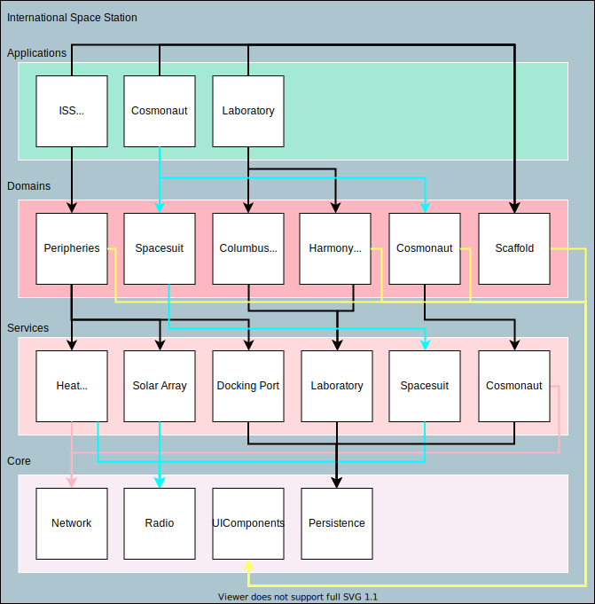
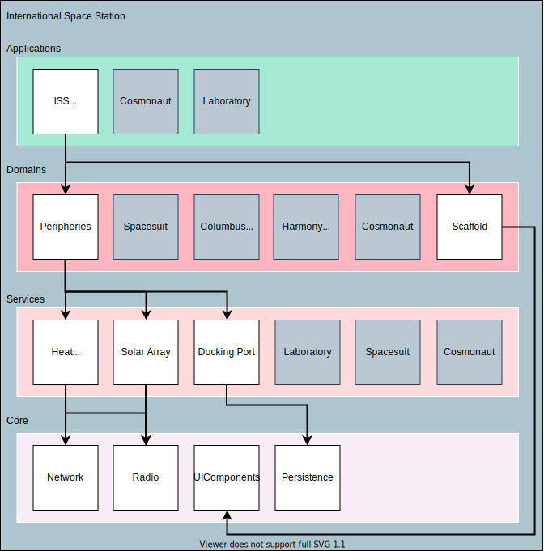
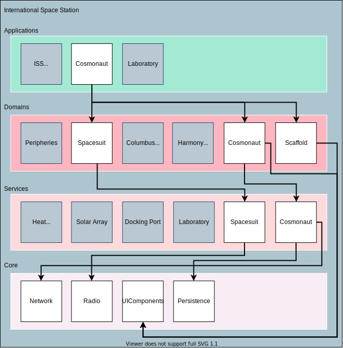

# Modular Architecture on iOS
Building Large Scale Modular iOS Apps And Frameworks

# Dedication 
"To my Mom and Dad, because they really tried."

&&

"To all my non-tech friends whom I am fixing problems with not enough disk space, printers, forgotten passcodes etc."

&&

"To all passionate engineers who are solving tough problems on a daily basis with a smile, it is great pleasure for everyone to work with you!"

&&

"Finally, to whoever my current girlfriend is..."

# About the author
Cyril Cermak is a software engineer by heart and author of this book. Most of his professional career was spent by building iOS apps or iOS frameworks. Beginning by Skoda Auto Connect App in Prague, continuing building iOS platform for Freelancer Ltd in Sydney and as of now being an iOS TechLead in Stuttgart for Porsche AG. In this book, Cyril describes different approaches for building modular iOS architecture so as some mechanisms and essential knowledge that should help you, the reader, to decide which approach would fit in the best or should be considered on your project.

## Reviewers
Joerg Nestele
... Ask Joerg whether he wants be the reviewer. 

# Table Of Contents
- Introduction 
  - What you need 
  - What is this book about 
  - What is this book NOT about 
  
  
- Modular Architecture 
  - Design 
  - Layers 
    - App Layer 
    - Domain Layer 
    - Service Layer 
    - Core Layer 
    - Shared Layer 
  - Example: International Space Station 
    - ISS Overview 
    - Cosmonaut 
    - Laboratory 
  - Conclusion 

  
- Libraries on Apple's ecosystem
  - Dynamic vs static library
    - Pros & Cons
  - Essentials
  - Exposing static 3rd party library
  - Examining dynamic library
    - Mach-O file format
    - Fat headers
    - Executable type
    - Dependencies
    - Symbols table
    - Strings
  - Compiler and Linker
    - (Step by step compiler process) // Topic for extension
  - Conclusion 

    
- Development of the modular architecture
  - Creating workspace structure
    - Automating the process
    - Xcode's workspace
  - Generating projects
    - Hello XcodeGen
  - Ground Rules
    - Cross linking dependencies
    - Vertical linking
  - Secrets
    - Mobile Secrets
  - Workflow
  - Scalability
  - Application Framework
    - Distribution 
    - The Software Foundation
  - Common Problems
  - Conclusion


- Design Patterns
  - Configurations
  - Coordinators
  - Decoupling
  - MVVM
  - Clean Architecture
  - Protocols
    
    
- Dependency Managers
  - Cocopods
  - Carthage
  - SwiftPM
    
    
- Distribution
  - Frameworks
  - XCFrameworks
  - Static Library
  - Open sourcing
  
  
- Project Automation
  - Motivation
  - Fastlane
  - Translations, Stages, Configurations etc.
  - Ruby


- CI/CD
  - Scripts execution


- GitFlow


- Profesional Experience
  - Joerg Nestele: iOS Tech Lead - Porsche AG
  - Majd Alfhailly: Senior iOS Engineer - Blinkst
  - Daniel Williams: Senior iOS Engineer - Canva
  - Aldrich Co: iOS Tech Lead - Freelancer Ltd.
  - Gleb Arkhipov: iOS Tech Lead - STRV
  
# Introduction

In the software engineering field, people are going from project to project, gaining different kind of experience out of it. Especially, on iOS mostly the monolithic approaches are used. In some cases it makes totally sense, so nothing against it. However, scaling up the team, or even better, team of teams on monolithically built app is horrifying and nearly impossible without some major time impacts on a daily basis. Numerous problems will rise up, that are limiting the way how iOS projects are built itself or even on the organisational level. 

Scaling up the monolithic approach to a team of e.g 7+ developers will most likely result in hell. By hell, I mean, resolving xcodeproj issues, where in the worst case both parties renamed or edited and deleted the same file, touched the same {storyboard|xib} file, or typically both worked on the same file which would resolve in classic merge conflicts. Somehow, those issues we all got used to live with...

The deal breaker will come when your PO/PM/CTO will come to the team to announce that they are planning to release a new flavour of the app or to divide the current app into two separate parts. Afterwards, the engineering decision needs to be made. Either, to continue with this monolithic approach, create different targets, assign files towards the new flavour of the app and continue living in multiplied hell and hoping that some requirement such as shipping core components of the app to a subsidiary or open-sourcing it as a framework will not come. 

Not surprisingly, a better approach would be to start refactoring the app into a modular approach, where each team can be responsible for particular frameworks (parts of the app) that are then linked towards those apps. That will take time as it will not be easy to transform but the future of company's mobile engineering will be faster, scalable, maintainable and even ready to distribute or open source some parts of it to the outer world.  

Another scenario could be, that you are already working on an app which is done in a modular way but your app takes at around 20 mins to compile. As it is a huge legacy codebase that was in development past 8 or so years and linked every possible 3rd party library along the way. The decision was made to modularise it with Cocoapods therefore, you cannot link easily already pre-compiled libraries with Carthage and every project clean you can take double shot of espresso. I had been there, trust me, it is another type of hell, definitely not a place where anyone would like to be. I described the whole migration process of such project [here](https://medium.com/freelancer-engineering/modular-architecture-on-ios-and-how-i-decreased-build-time-by-50-23c7666c6d2f). Of course, in this book you will read about it in more detail.

Nowadays, as an iOS tech lead, I am often getting asked some questions all over again from new teams or new colleagues regards those topics. Thereafter, I decided to sum it up and tried to get the whole subject covered in this book. I hope it will help developers working on such architectures to gain the speed, knowledge and understanding faster.

I hope this introduction gave enough motivation to deep dive further into this book.

## What you Need

The latest version of Xcode for compiling the demo examples, brew to install some mandatory dependencies, Ruby and Bundler for running scripts and downloading some Ruby gems. 

//TODO: Provide a tutorials for installing those softwares 

## What is this book about
This book describes essentials about building modular architecture on iOS. You will find examples of different approaches, framework types, pros and cons, common problems and so on. By the end of this book you should have a very good understanding of what benefits will bring such architecture to your project, whether it is necessary at all or which would be the best way for modularising the project.

At the end of this book, you can read experiences from the top notch iOS engineers working across numerous different projects from different countries and continents.

## What is this book NOT about
SwiftUI.


# Modular Architecture
<b>Modular</b>

   <i>`adjective - employing or involving a module or modules as the basis of design or construction: "modular housing units"`</i>
      
 In the introduction, I briefly touched the motivation for building the project in the modular way. To summaries it, modular architecture will give you much more freedom when it comes to the product decisions that will influence the overall app engineering. Such as, building another app for the same company, open-sourcing some parts of the existing codebase, scaling the team of developers and so on. With the already existing mobile foundation, it will be done way faster and cleaner.  
 
 To be fair, maintaining such software foundation of a company might be also really difficult. By maintaining, I mean, taking care of the CI/CD, old projects developed on top of the foundation that was heavily refactored in the meantime, legacy code, keeping it up-to date with the latest development tools and so on. No need to say, that on a very large project, this could be a work of one standalone team.
 
 This book describes different approaches of building such large scalable project by an example: The software foundation for the [International Space Station](https://en.wikipedia.org/wiki/International_Space_Station).
 
## Design
In this book, I chose to use the architecture that I think is the most evolved. It is a five layer architecture that consists of those layers:

- Application
- Domain
- Service
- Core
- Shared

Each layer is explained in the following chapter.

Nevertheless, the same principles can be applied for example for feature oriented architecture, where the layers could be defined as: 

- Application
- Feature
- Core
- Shared

Now let us have a look on what those layers will consist of.
## Layers
Let us have a look now on each layer and its purpose. Modules within the layers are then demonstrated with the example in the following chapter.

### Application Layer
Application layer consists of the final customer facing products; applications. Applications are linking domains and via configurations and Scaffold module glueing all the different parts together. In such architecture, the App is basically a container that puts pieces together. 

Nevertheless, App might also contain some necessary Application implementations like receiving push notifications, handling deep linking, permissions and so on.

Patterns, that will help achieve such goals will be described later.   

For example an app in an e-commerce business could be `The Shop` for online customer and `Cashier` for the employees of that company.

### Domain Layer
Domain layer links services and other modules from layers below and uses them to implement business domain needs of the company or the project. Domains will contain for example the users flow within the particular domain part of the app. So as, the necessary components for it like; view controllers, views, models and view models. No need to say, that it depends on the teams preferences and technical experience which pattern will be used for creating screens. Personally, the reactive MVVM+C is my favourite but more on that later.  

For example a domain in an e-commerce app could be a `Checkout` or `Store Items`.   

### Service Layer
Services are modules supporting domains. Each domain, can link several services in order to achieve desired outcomes. Such service will most likely talk to the backend, get the data out of it, persist them in its own storage and expose them to domains.   

For example a service in an e-commerce app could be a `Checkout Service` which will handle all the necessary communication with the backend so as proceeding with the credit card payments etc.
   
### Core Layer
Core layer is the enabler for the whole app. Services will link the necessary modules out of it for e.g communicating with the backend or persisting the data. Domains will link e.g ui components for easier implementation o  screens and so on.

For example a core module in an e-commerce app could be `Network` or `UIComponents`

### Shared Layer
Shared layer is a supporting layer for the whole framework. It can happen that this layer might not need to exist. However, a perfect example for the shared layer is logging. Where even core layer modules will want to log some output. That would potentially lead to duplicates, which could be solved by the shared layer. 
  
For example a shared module in an e-commerce app could be `Logging` or `AppAnalytics`

## Example: International Space Station

Now in this example, let us have a look at how such architecture could really look like for [International Space Station](https://en.wikipedia.org/wiki/International_Space_Station). Diagram below shows the four layer architecture with the modules and linking. 

While this chapter is rather theoretical, in the following chapter everything will be explained and showcased in practice.  

 

The example has three applications. 
- `ISS Overview`: app that shows astronauts the overall status of the space station
- `Cosmonaut`: app where Cosmonaut can control his spacesuit so as his supplies and personal information
- `Laboratory`: app from which the laboratories on the space station can be controlled 

As described above, all apps are linking Scaffold module which provides the bootstrapping for the app as the app itself is the container.

### ISS Overview
`ISS Overview` app links `Peripheries` domain which implements logic and screens for peripheries of the station.  

The `Peripheries` domain links `Heat Radiator`, `Solar Array` and `Docking Port` services from whom the data about those peripheries are gathered so as `UIComponents` for bootstrapping the screens development. 

Linked services are using `Network` and `Radio` core modules which are providing the foundation for the communication with other systems via network protocols. `Radio` in this case could implement some communication channel via BLE or other technology which would connect to the solar array or heat radiator. Diagram below describes the concrete linking of modules for the app.

 
 
 
### Cosmonaut
`Cosmonaut` app links `Spacesuit` and `Cosmonaut` domains. Same as for every other domain, each module is responsible for screens and users flow through the part of the app.

`Spacesuit` and `Cosmonaut` domains link `Spacesuit` and `Cosmonaut` services that are providing data for domain defined screens so as `UIComponents` who are providing the UI parts.


`Spacesuit` service is using `Radio` for communication with cosmonauts spacesuit via BLE or other type of radio technology. `Cosmonaut` service is using `Network` for updating Huston about the current state of the `Cosmonaut` so as `Persistence` for storing the date of the cosmonaut for offline usage. 

 
### Laboratory

I will leave this one for the reader to figure it out. 
 
## Conclusion

As you can probably imagine, scaling of the architecture described above should not be a problem. When it comes to extending for example the ISS Overview app for another ISS periphery, a new domain module can be easily added with some service modules etc. 

When a requirement comes for creating a new app for e.g. cosmonauts, the new app can already link the battlefield tested Cosmonaut domain module with other necessary modules that are required. Development of the new app will become way more easier due to that.

The knowledge of the software remains in one repository or one project where developers have access to and can learn from is also very beneficial.         

There are of course some disadvantages as well. For example, onboarding new developers on such architecture might take a while, especially when there is already huge existing codebase. There, the pair programming comes into play. So as, proper project onboarding, software architecture documents and the overall documentation of modules and the whole project.

   
# Libraries on Apple's ecosystem

Before we deep dive into the development of previously described architecture there is some essential knowledge that needs to be explained. Especially, the type of library that is going to be used for building such project and its behaviour.

In Apple's ecosystem as of today we have two main options when it comes to creating a library. The library can either be statically or dynamically linked. Dynamic library previously known as `Cocoa Touch Framework`,  nowadays simplified to `Framework` and the statically linked, the `Static Library`.

 

**What is a library?**

To quote Apple:
*"Libraries define symbols that are not built as part of your target."*

What are symbols?
*Symbols reference to chunks of code or data within binary.*

**Types of libraries:**

1) Dynamicaly linked
  - **Dylib**: Library that has its own Mach-O (explained later) binary. (`.dylib`)
  - **Framework**: Framework is a bundle that contains the binary and other resources the binary might need during the run time. (`.framework`)
  - **TBDs**: Text Based Dynamic Library Stubs is a text stubbed library (symbols only) around a binary without including it as the binary resides on the target system, used by Apple to ship lightweight SDKs for development. (`.tbd`)
  - **XCFramework**: From Xcode 11 the XCFramework was introduced which allows to group a set of frameworks for different platforms e.g `macOS`, `iOS`, `iOS simulator`,`watchOS` etc. (`.xcframework`)

2) Statically linked
  - **Archive**: Archive of a compiler produced object files with object code. (`.a`)
  - **Framework**: Framework contains the static binary or static archive with additional resources the library might need. (`.framework`)
  - **XCFramework**: Same as for dynamically linked library the XCFramework can be used with statically linked. (`.xcframework`)

We can look at a framework as some bundle that is standalone and can be attached to a project with its own binary. Nevertheless, the binary cannot run by itself, it must be part of some target. 

## Dynamic vs static library?

The main difference between a static and dynamic library is in the Inversion Of Control (IoC) and how they are linked towards the main executable. When you are using something from a static library, you are in control of it as it becomes part of the main executable during build process (linking). On the other hand when you are using something from a dynamic framework you are passing responsibility for it to the framework as framework is dynamically linked on the app start to the executables process. I’ll delve more into IoC in the paragraph below. Static libraries, at least on iOS, cannot contain anything other than the executable code unless they are wrapped into a static framework. A framework (dynamic or static) can contain everything you can think of e.g storyboards, xibs, images and so on…

As mentioned above, the way dynamic framework code execution works is slightly different than in a classic project or a static library. For instance, calling a function from the dynamic framework is done through a frameworks interface. Let’s say a class from a framework is instantiated in the project and then a specific method is called on it. When the call is being done you are passing the responsibility for it to the dynamic framework and the framework itself then makes sure that the specific action is executed and the results then passed back to the caller. This programming paradigm is known as Inversion Of Control. Thanks to the umbrella file and module map you know exactly what you can access and instantiate from the dynamic framework after the framework was built.   

A dynamic framework does not support any Bridging-Header file; instead there is an umbrella.h file. An umbrella file should contain all Objective-C imports as you would normally have in the bridging-Header file. The umbrella file is basically one big interface for the dynamic framework and it is usually named after the framework name e.g myframework.h. If you do not want to manually add all the Objective-C headers, you can just mark `.h` files as public. Xcode generates headers for ObjC for public files when building. It does the same thing for Swift files as it puts the ClassName-Swift.h into the umbrella file and exposes the Swift publicly available interfaces via swiftmodule definition. You can check the final umbrella file and swiftmodule under the derived data folder of the compiled framework.

On the other hand, static library is attached directly to the main executable during linking as a library contains already pre-compiled archive of the source files with symbols. That being said, there is no need for umbrella file so as IoC like in dynamic framework.

No need to say, classes and other structures must be marked as public to be visible outside of a framework or a library. Not surprisingly, only objects that are needed for clients of a framework or a library should be exposed.

### PROS & CONS
Now let's have a look at some pros & cons of both binaries.

**Dynamic:**

  - **PROS**
    - Faster app start time as library is linked during app launch time or runtime, therefore the main executable has lesser memory footprint to load
    - Can be opened on demand, therefore might not get opened at all if user do not open specific part of the app (`dlopen`)
    - Can be linked transitively to other dynamic libraries without any difficulty
    - Can be exchanged without the recompile of the main executable just by replacing the framework with a new version
    - Is loaded into a different memory space than the main executable 
    - Can be shared in between applications especially useful for system libraries
    - Can be loaded partially, only the needed symbols can be loaded into the memory (`dlsym`)
    - Can be loaded lazily, only objects that are referenced will be loaded
    - Library can perform some cleanup tasks when it is closed (`dlclose`)
  
  - **CONS**
    - The target must copy all dynamic libraries else the app crashes on the start or during runtime with `dyld library not found`
    - The overall size of the binary is bigger than the static one as compiler can strip of symbols from the static library during the compile time while in dynamic library the symbols at least the public ones must remain 
    - Potential replace of a dynamic library with a new version with different interfaces can break the main executable
    - Slower library API calls as it is loaded into a different memory space and called via library interface
    - App's executable can be linked against incompatible library version
    - Launch time of the app might take longer if all dynamic libraries are opened during the launch time
  
**Static:**

  - **PROS**
    - Is part of the main executable therefore, the app cannot crash during launch or runtime due to a missing library
    - Overall smaller size of the final executable as the symbols can be stripped of
    - In terms of calls speed there is no difference in between the main executable and the library as the library is part of the main executable
    - Compiler can provide some extra optimisation during the build time of the main executable   

  - **CONS**  
  
    - The library must NOT be linked transitively, the library must be present only once in the memory either in the main executable or one of its dependencies
    - The main executable must be recompiled when the library has an update even though the library's interface remains the same
    - Memory footprint of the main executable is bigger which implies the load time is slower

## Essentials

When building any kind of modular architecture, it is crucial to keep in mind that a static library is attached to the executable while dynamic one is opened and linked at the start time. Thereafter, if there are two frameworks linking the same static library the app will launch with warnings `Class loaded twice ... one of them will be used.` issue. That causes much slower app start as the app needs to decide which of those classes will be used. So as, in the worst case when two different versions of the same static library are used the app will use them interchangeably. The debugging will become a horror if that case happens that being said, it is very important to be sure that the linking was done right and no warnings appears.   

All that is the reason why using dynamically linked frameworks for internal development is the way to go. However, working with static libraries is unfortunately inevitable especially when working with 3rd party libraries. Big companies like Google, Microsoft or Amazon are using static libraries for distributing their SDKs. For example: `GoogleMaps`, `GooglePlaces`, `Firebase`, `MSAppCenter` and all subsets of those SDKs are linked statically. 

When using 3rd party dependency manager like Cocoapods for linking one static library attached to more than one project (App or Framework) it would fail the installation with `target has transitive dependencies that include static binaries`. Therefore, it takes an extra effort to link static binaries into multiple frameworks.

Let's have a look how to link such static library into a dynamically linked SDK. 

## Exposing static 3rd party library

As mentioned above, it takes an extra effort to link a static library or static framework into a dynamically linked projects correctly. The crucial part is to make sure that it is linked only at one place. Either towards one dynamic framework where the static library can be exposed via umbrella file and then everywhere where the framework is linked the static library can be accessed through it as well. Or, only towards the app target from where it cannot be exposed anywhere else but via some level of abstraction it can be passed through to other frameworks on the code level. The same applies for static framework.

As an example of such umbrella file exposing GoogleMaps library that was linked to it could be:

```ObjC
// Framework.h - Umbrella file
#import <UIKit/UIKit.h>
#import "GoogleMaps/GoogleMaps.h"
```      

The import of the header file of `GoogleMaps` into the frameworks umbrella file exposes all public headers of the GoogleMaps because of the `GoogleMaps.h` has all the GoogleMaps public headers.

```ObjC
// GoogleMaps.h
#import "GMSIndoorBuilding.h"
#import "GMSIndoorLevel.h"
#import "GMSAddress.h"
...
``` 

From now on it is sufficient to link and import the dynamic framework which allows then direct access to the static GoogleMaps framework. In case of the static GoogleMaps framework, it is necessary to copy its bundle towards the app as there the GoogleMaps binary is looking for its resources like translations, images and so on. 

## Examining library

Let us have a look at some of the commands that comes in handy when solving some problems when it comes to compiler errors or receiving compiled closed source dynamic framework or a static library. To give it a quick start let's have a look at a binary we all know very well; UIKit. The path to the UIKit.framework is: `/Applications/Xcode.app/Contents/Developer/Platforms/iPhoneOS.platform/Library/Developer/CoreSimulator/Profiles/Runtimes/iOS.simruntime/Contents/Resources/RuntimeRoot/System/Library/Frameworks/UIKit.framework`

Apple ships various different tools for exploring compiled libraries and frameworks. On the UIKit framework I will demonstrate only essential commands that I find useful quite often.

### Mach-O file format

Before we start, it is useful to know what we are going to be exploring. In Apple ecosystem, file format of any binary is called Mach-O (Mach object). Mach-O has a pre-defined structure starting with Mach-O header following by segments, sections, load commands and so on.  

Since you are surely a curious reader, you are now having tons of questions about where it all comes from. The answer to that is quite simple. Since it is all part of the system you can open up Xcode and look for a file in a global path `/usr/include/mach-o/loader.h`. In the `loader.h` file for example the Mach-O header struct is defined.

```c++
/*
 * The 64-bit mach header appears at the very beginning of object files for
 * 64-bit architectures.
 */
struct mach_header_64 {
	uint32_t	magic;		/* mach magic number identifier */
	cpu_type_t	cputype;	/* cpu specifier */
	cpu_subtype_t	cpusubtype;	/* machine specifier */
	uint32_t	filetype;	/* type of file */
	uint32_t	ncmds;		/* number of load commands */
	uint32_t	sizeofcmds;	/* the size of all the load commands */
	uint32_t	flags;		/* flags */
	uint32_t	reserved;	/* reserved */
};
```

When compiler produces final executable the Mach-O header is placed at a concrete byte position in it. Therefore, tools that are working with the executables knows exactly where to look for desired information. The same principle applies to all other parts of Mach-O as well.  

`// TODO: Redirect to an article or explain here?`

For further exploration of Mach-O file, I would recommend reading the following [article](https://medium.com/@cyrilcermak/exploring-ios-es-mach-o-executable-structure-aa5d8d1c7103.).

### Fat headers

First, let's have a look on what Architectures the binary can be linked on (fat headers). For that, we are going to use `otool`;the utility that is shipped within every macOS. To list fat headers of a compiled binary we will use the flag `-f` and to produce a symbols readable output I also added the `-v` flag.

```shell
otool -fv ./UIKit
```
Not surprisingly, the output produces two architectures. One that runs on the Intel mac (`x86_64`) when deploying to simulator and one that runs on iPhones so as on recently introduced M1 mac (`arm64`). 
```
Fat headers
fat_magic FAT_MAGIC
nfat_arch 2
architecture x86_64
    cputype CPU_TYPE_X86_64
    cpusubtype CPU_SUBTYPE_X86_64_ALL
    capabilities 0x0
    offset 4096
    size 26736
    align 2^12 (4096)
architecture arm64
    cputype CPU_TYPE_ARM64
    cpusubtype CPU_SUBTYPE_ARM64_ALL
    capabilities 0x0
    offset 32768
    size 51504
    align 2^14 (16384)
```

When the command finishes successfully while not printing any output it simply means that the binary does not contain the fat header. That being said, the library can run only on one architecture and to see what the architecture is we have to print out the mach-o header of the executable.

```shell
otool -hv ./UIKit
```
From the output of the Mach-O header we can see that the `cputype` is `X86_64` so as some extra information like which `flags` the library was compiled with, `filetype` and so on.
```
Mach header
      magic cputype cpusubtype  caps    filetype ncmds sizeofcmds      flags
MH_MAGIC_64  X86_64        ALL  0x00       DYLIB    21       1400   NOUNDEFS DYLDLINK TWOLEVEL APP_EXTENSION_SAFE
```

### Executable type

Second, let us determine what type of a library we are dealing with. For that we will use again the `otool` as mentioned above Mach-O header specifies `filetype`. So running it again on the UIKit.framework with the `-hv` flags produces the following output:  

```
Mach header
      magic cputype cpusubtype  caps    filetype ncmds sizeofcmds      flags
MH_MAGIC_64  X86_64        ALL  0x00       DYLIB    21       1400   NOUNDEFS DYLDLINK TWOLEVEL APP_EXTENSION_SAFE
```
From the output's `filetype` we can see that it is a dynamically linked library. From its extension we can say it is a dynamically linked framework. Like described before, framework can be dynamically or statically linked. The perfect example of statically linked framework is `GoogleMaps.framework`. When running the same command on the binary of `GoogleMaps` from the output we can see that the binary is NOT dynamically linked as its type is `OBJECT` aka object files which means that the library is static and linked to the attached executable at the compile time.

```
Mach header
      magic cputype cpusubtype  caps    filetype ncmds sizeofcmds      flags
MH_MAGIC_64  X86_64        ALL  0x00      OBJECT     4       2688 SUBSECTIONS_VIA_SYMBOLS
```
The reason for wrapping the static library into a framework was the necessary include of `GoogleMaps.bundle` which needs to be copied to the target in order the library to work correctly with its resources.

Now, let's try to run the same command on the static library archive. As an example we can use again one of the Xcode's libraries located at `/Applications/Xcode.app/Contents/Developer/Toolchains/XcodeDefault.xctoolchain/usr/lib/swift/iphoneos/libswiftCompatibility50.a` path. From the library extension we can immediately say the library is static. Running the `otool -hv libswiftCompatibility50.a` just confirms that the `filetype` is `OBJECT`.

```
Archive : ./libswiftCompatibility50.a (architecture armv7)
Mach header
      magic cputype cpusubtype  caps    filetype ncmds sizeofcmds      flags
   MH_MAGIC     ARM         V7  0x00      OBJECT     4        588 SUBSECTIONS_VIA_SYMBOLS
Mach header
      magic cputype cpusubtype  caps    filetype ncmds sizeofcmds      flags
   MH_MAGIC     ARM         V7  0x00      OBJECT     5        736 SUBSECTIONS_VIA_SYMBOLS
...
```

While static library archive ending with `.a` is clearly static one with a framework to be really sure that the library is dynamically linked it is necessary to check the binary for its `filetype` in the Mach-O header.

### Dependencies
Third, let's have a look at what the library is linking. For that the `otool` provides `-l` flag.
```shell
otool -L ./UIKit
```
The output lists all dependencies of UIKit framework. For example, here you can see that UIKit is linking `Foundation`. That's why the `import Foundation` is no longer needed when importing `UIKit` into a source code file.

```
./UIKit:
	/System/Library/Frameworks/UIKit.framework/UIKit (compatibility version 1.0.0, current version 3987.0.109)
	/System/Library/Frameworks/FileProvider.framework/FileProvider (compatibility version 1.0.0, current version 1.0.0, reexport)
  /System/Library/Frameworks/Foundation.framework/Foundation (compatibility version 300.0.0, current version 1751.108.0)
  /System/Library/PrivateFrameworks/DocumentManager.framework/DocumentManager (compatibility version 1.0.0, current version 200.0.0, reexport)
	/System/Library/PrivateFrameworks/UIKitCore.framework/UIKitCore (compatibility version 1.0.0, current version 3987.0.109, reexport)
	/System/Library/PrivateFrameworks/ShareSheet.framework/ShareSheet (compatibility version 1.0.0, current version 1564.6.0, reexport)
	/usr/lib/libobjc.A.dylib (compatibility version 1.0.0, current version 228.0.0)
	/usr/lib/libSystem.B.dylib (compatibility version 1.0.0, current version 1292.0.0)
```

### Symbols table

Fourth, it is also useful to know what are the symbols that are defined in the framework. For that the `nm` utility is available. To print all symbols including the debugging ones I added `-a` flag so as `-C` to print them demangled. The name mangling is a technique of adding extra information about the language data type (class, struct, enum ...) to the symbol during compile time in order to pass more information about it to the linker. With mangled symbol the linker will know that this symbols is for a class, getter, setter etc and can work with it accordingly. 

```shell
nm -Ca ./UIKit
```
Unfortunately, the output here is very limited as those symbols listed are the ones that defines the dynamic framework itself. The limitation is because of Apple ships the binary obfuscated and when reverse engineering the binary with for example Radare2 disassembler, all we can see is couple of `add byte` assembly instructions. It is still possible to dump the list of symbols but for that we would have to either use `lldb` and have the UIKit framework loaded in the memory space or dump the memory footprint of the framework and explore it decrypted. That is unfortunately not part of this book.
```
0000000000000ff0 s _UIKitVersionNumber
0000000000000fc0 s _UIKitVersionString
                 U dyld_stub_binder
```
Just to give an example how the symbols would look like I printed out compiled realm framework by running `nm -Ca ./Realm`. 
```
...
00000000002c4650 T realm::Table::do_move_row(unsigned long, unsigned long)
00000000002cb1e8 T realm::Table::do_set_link(unsigned long, unsigned long, unsigned long)
00000000004305e0 S realm::Table::max_integer
00000000004305e8 S realm::Table::min_integer
00000000002c44b4 T realm::Table::do_swap_rows(unsigned long, unsigned long)
00000000002ce9bc T realm::Table::find_all_int(unsigned long, long long)
00000000002cb3ac T realm::Table::get_linklist(unsigned long, unsigned long)
00000000002c4d64 T realm::Table::set_subtable(unsigned long, unsigned long, realm::Table const*)
00000000002ba4f0 T realm::Table::add_subcolumn(std::__1::vector<unsigned long, std::__1::allocator<unsigned long> > const&, realm::DataType, realm::StringData)
00000000002bd9f8 T realm::Table::create_column(realm::ColumnType, unsigned long, bool, realm::Allocator&)
00000000002bf3fc T realm::Table::discard_views()
...
```
It seams like Realm was developed in C++ but it can be clearly seen what kind of symbols are available within the binary. One more example for Swift with Alamofire. There we can unfortunately see that the `nm` was not able to demangle the symbols.  
```
...
0000000000034d00 T _$s9Alamofire7RequestC8delegateAA12TaskDelegateCvM
0000000000034dc0 T _$s9Alamofire7RequestC4taskSo16NSURLSessionTaskCSgvg
0000000000034e20 T _$s9Alamofire7RequestC7sessionSo12NSURLSessionCvg
0000000000034e50 T _$s9Alamofire7RequestC7request10Foundation10URLRequestVSgvg
00000000000350c0 T _$s9Alamofire7RequestC8responseSo17NSHTTPURLResponseCSgvg
00000000000351e0 T _$s9Alamofire7RequestC10retryCountSuvpfi
...
```
To demangle swift manually following command can be used.
```shell
nm -a ./Alamofire | awk '{ print $3 }' | xargs swift demangle {} \;
```
Which produces the mangled symbol name with the demangled explanation.
```
...
_$s9Alamofire7RequestC4taskSo16NSURLSessionTaskCSgvg ---> Alamofire.Request.task.getter : __C.NSURLSessionTask?
_$s9Alamofire7RequestC4taskSo16NSURLSessionTaskCSgvgTq ---> method descriptor for Alamofire.Request.task.getter : __C.NSURLSessionTask?
_$s9Alamofire7RequestC10retryCountSuvpfi ---> variable initialization expression of Alamofire.Request.retryCount : Swift.UInt
...
```

### Strings

Last but not least, it can be also helpful to list all strings that the binary contains. That could help catch developers mistakes like not obfuscated secrets and some other strings that should not be part of the binary. To do that we will use `strings` utility again on the Alamofire binary.
```shell
strings ./Alamofire
```
The output is a list of plain text strings found in the binary.
```
...
Could not fetch the file size from the provided URL:
The URL provided is a directory:
The system returned an error while checking the provided URL for
reachability.
URL:
The URL provided is not reachable:
...
```

## Build system

Last piece of information that is missing now is; how it all gets glued together. As Apple developers, we are using Xcode for developing apps for Apple products that are then distributed via App Store or other distribution channels. Xcode under the hood is using `Xcode Build System` for producing final executables that runs on `X86` and `ARM` processor architectures.

The Xcode build system consists of multiple steps that depends on each other. Xcode build system supports C based languages (C, C++, Objective-C, Objective-C++) compiled with `clang` so as Swift language compiled with `swiftc`. 

Let's have a quick look at what Xcode does when the build is triggered.

1. **Preprocessing**

  Preprocessing resolves macros, removes comments, imports files and so on. In a nutshell it prepares the code for the compiler. Preprocessor also decides which compiler will be used for which source code file. Not surprisingly, swift source code file will be compiled by swiftc and other C like files will use clang.

2. **Compiler** (`swiftc`, `clang`)

  As mentioned above, Xcode build system uses two compilers; clang and swiftc. Compiler consists of two parts, front-end and back-end. Both compilers are using the same back-end, LLVM (Low Level Virtual Machine) and language specific front-end. The job of a compiler is to compile the preprocessed source code files into object files which contains object code. Object code is simply human readable assembly instructions that can be understood by the CPU.   

3. **Assembler** (`asm`)

  Assembler takes the output of the compiler (assembly) and produces relocatable machine code. Machine code is recognised by a concrete type of a processor (ARM, X86). The opposite of relocatable machine code would be absolute machine code. While relocatable code can be placed at any position in memory by loader the absolute machine code has its position set in the binary.   

4. **Linker** (`ld`)

  Final step of the build system is linking. Linker is a program that takes object files (multiple compiled files) and links (merges) them together based on the symbols those files are using so as links static and dynamic libraries if needed. In order to be able to link libraries linker needs to know the paths where to look for them. Linker produces final single file; Mach-O executable.

5. **Loader** (`loader`)

  After the executable was built the job of a loader is to bring the executable into memory and start the program execution. Loader is a system program operating on the kernel level. Loader assigns the memory space and loads Mach-O executable to it. 
  
Now you should have a high level overview of what phases Xcode build system goes through when the build is started.

## Conclusion
I hope this chapter gave the essentials of what is the difference in between static and dynamic library so as some examples of how to examine them. It was quite a lot to grasp so now it's time for a double shot of espresso or any kind of preferable refreshment.

I would highly recommend to deep dive into this topic even more. Here are some resources I would recommend; 

How does the executable structure looks like:
https://medium.com/@cyrilcermak/exploring-ios-es-mach-o-executable-structure-aa5d8d1c7103

Static and dynamic libraries and manual compile examples:
https://pewpewthespells.com/blog/static_and_dynamic_libraries.html

Difference in between static and dynamic library from our beloved StackOverflow:
https://stackoverflow.com/questions/15331056/library-static-dynamic-or-framework-project-inside-another-project

The official Apple documentation about dynamic libraries:
https://developer.apple.com/library/archive/documentation/DeveloperTools/Conceptual/DynamicLibraries/000-Introduction/Introduction.html#//apple_ref/doc/uid/TP40001908-SW1

To know more about the Xcode build system:
https://medium.com/flawless-app-stories/xcode-build-system-know-it-better-96936e7f52a
https://www.objc.io/issues/6-build-tools/mach-o-executables/
https://llvm.org/
https://developer.apple.com/videos/play/wwdc2018/415/
https://developer.apple.com/videos/play/wwdc2018/408/

Used binaries: 
GoogleMaps: https://developers.google.com/maps/documentation/ios-sdk/v3-client-migration#install-manually
Alamofire: https://github.com/Alamofire/Alamofire
Realm: https://realm.io/docs/swift/latest

# Development of the modular architecture

The necessary theory about Apple's libraries and some essentials were explained. Thereafter, it is time to deep dive into the building phase. 

First, let us do it manually and automate the process of creating libraries later on so that new comers do not have to copy paste much of the boilerplate code when starting a new team or part of the framework. 

First of all let us create the folders structure and the first app in it. For the first app, I chose the Cosmonaut app with all its necessary dependencies. Nevertheless, the same principle applies for all other apps within our future iOS/macOS ISS foundational framework. 

You can either follow the steps described here and build it from scratch or download the pre-build repository [here](TODO://).  

As a reminder the following schema showcases the Cosmonaut app with its dependencies.  
 

## Creating workspace structure

First let us manually create the Cosmonaut app from Xcode under the `iss_application_framework/app/` directory. To achieve that, simply create a new App from the Xcode's menu and save it under the predefined folder path with the `Cosmonaut` name. An empty project app should be created, you can run it if you want. Nevertheless, for our purposes project is not optimal. We will be working in a workspace which will contain multiple projects(apps and frameworks). 

 

Since we do not have `Cocopods` yet which would convert the project to the workspace we have to do it manually. In Xcode under `File` select the option `Save As Workspace`, close the project and open the newly created Workspace by Xcode. So far the workspace contains only the App. Now it is time to create the necessary dependencies for the Cosmonaut app.

Going top down through the diagram, first comes the `Domain` layer where `Spacesuit`, `Cosmonaut` and `Scaffold` is needed to be created. For creating the `Spacesuit` let us use Xcode one last time. Under the new project select the framework icon name it `Cosmonaut` and save it under the `iss_application_framework/domain/` directory. 


### Automating the process

While creating new frameworks and apps is not a daily business the process still needs to assure that correct namespaces and conventions are used across the whole application framework. This usually leads to a copy-pasting already created framework or app in order to create a new one with the same patterns. Now is good time to create first script that will support the development of the application framework.

If you are building the application framework from scratch please copy the `fastlane` directory from the repository into your `iss_application_framework` directory. 

The scripting around the framework with `Fastlane` is explained later on in the book. However, all you need to know now is that Fastlane contains lane `make_new_project` that takes three arguments; `type` {app|framework}, `project_name` and `destination_path`. The lane in Fastlane simple uses the instance of the `ProjectFactory` class located in the `scripts/ProjectFactory/project_factory.rb` file. 

The `ProjectFactory` creates new framework or app based on the `type` parameter that is passed to it from the command line. As an example of creating the Spacesuit domain framework the following command can be used. 

```shell
fastlane make_new_project type:framework project_name:Spacesuit destination_path:../domain/Spacesuit
```  

In case of Fastlane not being installed on your mac you can install it via `brew install fastlane` or later on via Ruby `gems` defined in `Gemfile`. For installation please follow the official [manual](https://docs.fastlane.tools/getting-started/ios/setup/). 

Furthermore, we can continue creating all dependencies via the script up until the point where all dependencies were created is reached.

The overall ISS Application Framework should look as follows:


Each directory contains Xcode project which is either a framework or an app created by the script. From now on, every onboarded team or developer should use the script to create a framework or an app that will be developed.

### Xcode's workspace
Last but not least, let us create the same directory structure in the Xcode's Workspace so that we can later on link those frameworks together and towards the app. In the Cosmonaut app our `Cosmonaut.xcworkspace` resides. An `xcworkspace` is simply a structure that contains;
 - `xcshareddata`: Directory that contains schemes, breakpoints and other shared information
 - `xcuserdata`: Directory that contains information about the current users interface state, opened/modified files of the user and so on
 - `contents.xcworkspacedata`: An XML file that describes what projects are linked towards the workspace such that Xcode can understand it

The workspace structure can be created either by drag and dropping all necessary framework projects for the `Cosmonaut` app or by directly modifying the `contents.xcworkspacedata` XML file. No matter which way was chosen the final `xcworkspace` should look as follow:


## Generating projects
You might have noticed `project.yml` file that was created with every framework or app. This file is used by `XcodeGen` (will be introduced in a second) to generate the project based on the settings described in the yaml file. This will avoid conflicts in the Apple's infamous `project.pbxproj` files that are representing each project. In the modular architecture this is particularly useful as we are working with many projects across the workspace. 

Conflicts in the `project.pbxproj` files are very common when more than one developer are working on the same codebase. Besides the build settings for the project, the file also contains and tracks files that are included for the compilation so as which target they belongs to. A typical conflict happens when one developer removes a file from the Xcode's structure while another developer was modifying it in a separate branch. This will resolve in a merge conflict in the `pbxproj` file which is very time consuming to fix as the file is using Apple's mystified language no one can understand. 

Since programmers are lazy creatures, very often also happens that the file that was removed from the Xcode's project still remains in the repository as it was not moved to the trash. That could lead to a git tracking of those unused files inside of the repository so as re-adding the deleted file to the project by the developer who was modifying it.

### Hello XcodeGen
Fortunately, in the Apple ecosystem we can use [xcodegen](https://github.com/yonaskolb/XcodeGen), a program that generates the pbxproj file for us based on the well-arranged yaml file. In order to use it we have to first install it via `brew install xcodegen` or via other ways described on its homepage.

As an example let us have a look at the Cosmonaut app project.yml. 

```yaml
# Import of the main build_settings file
include:
  - ../../fastlane/build_settings.yml

# Definition of the project
name: Cosmonaut
settings:
  groups:
    - BuildSettings

# Definition of the targets that exists within the project
targets:
  
  # The main application
  Cosmonaut:
    type: application
    platform: iOS
    sources: Cosmonaut
    dependencies:
      # Domains
      - framework: ISSCosmonaut.framework
        implicit: true
      - framework: ISSSpacesuit.framework
        implicit: true
      - framework: ISSScaffold.framework
        implicit: true
      # Services
      - framework: ISSSpacesuitService.framework
        implicit: true
      - framework: ISSCosmonautService.framework
        implicit: true
      # Core
      - framework: ISSNetwork.framework
        implicit: true
      - framework: ISSRadio.framework
        implicit: true
      - framework: ISSPersistence.framework
        implicit: true
      - framework: ISSUIComponents.framework
        implicit: true
  
  # Tests for the main application
  CosmonautTests:
    type: bundle.unit-test
    platform: iOS
    sources: CosmonautTests
    dependencies:
      - target: Cosmonaut
    settings:
      TEST_HOST: $(BUILT_PRODUCTS_DIR)/Cosmonaut.app/Cosmonaut

  # UITests for the main application
  CosmonautUITests:
    type: bundle.ui-testing
    platform: iOS
    sources: CosmonautUITests
    dependencies:
      - target: Cosmonaut
``` 

Even though the yaml file speaks for itself, some explanation is needed.

First of all, the `include` in the very beginning.

```yaml
# Import of the main build_settings file
include:
  - ../../fastlane/build_settings.yml
```
Before xcodegen starts generating the pbxproj project it processes and includes other yaml files if the include keyword is found. In case of the application framework this is extremely helpful as the build settings for each project can be described just by one yaml file. 

Imagine a scenario where the iOS deployment version must be bumped up for the app. Since the app links also many frameworks which are being compiled before the app, their deployment target also needs to be bumped up. Without XcodeGen, each project would have to be modified to have the new deployment target. Even worse, when trying some build settings out instead of modifying it on each project a simple change in one file that is included into the others will do the trick.   

A simplified build settings yaml file could look like this:

```yaml
options:
  bundleIdPrefix: com.iss
  developmentLanguage: en
settingGroups:
  BuildSettings:
    base:
    # Architectures
      SDKROOT: iphoneos
    # Build Options
      ALWAYS_EMBED_SWIFT_STANDARD_LIBRARIES: $(inherited)
      DEBUG_INFORMATION_FORMAT: dwarf-with-dsym
      ENABLE_BITCODE: false
    # Deployment
      IPHONEOS_DEPLOYMENT_TARGET: 13.0
      TARGETED_DEVICE_FAMILY: 1
...
```

Worth mentioning is that in the `BuildSettings` the key in the yaml matches with Xcode build settings which can be seen in the inspector side panel. As you can see the `BuildSettings` key is then referred inside the project.yml file under the settings right after the project name.

```yaml
name: Cosmonaut
settings:
  groups:
    - BuildSettings
```

The following key is `targets`. In case of the Cosmonaut application we are setting three targets. One for the app itself, one for unit tests and finally one for ui tests. Each key sets the name of the target and then describes it with `type`, `platform`, `dependencies` and other parameters XcodeGen supports.

Next, let us have a look at the dependencies.
```yaml
dependencies:
  # Domains
  - framework: ISSCosmonaut.framework
    implicit: true
  - framework: ISSSpacesuit.framework
    implicit: true
  - framework: ISSScaffold.framework
    implicit: true
...
```

Dependencies links the specified frameworks towards the app. On the snippet above you can see which dependencies the app is using. The `implicit` keyword with the framework means that the framework is not pre-compiled and requires compilation in order to be found. That being said, the framework needs to be part of the workspace in order the build system to work. Another parameter that can be stated there is `embeded: {true|false}`. This parameter sets whether the framework will be embedded with the app and copied into the target. By default XcodeGen has `embeded: true` for applications as they have to copy the compiled framework to the target in order the app to launch successfully and `embeded: false` for frameworks. Since framework is not a standalone executable and must be part of some application it is expected that the application copies it.

Full documentation of XcodeGen can be found on its GitHub [page](https://github.com/yonaskolb/XcodeGen): 

Finally, let's generate the projects and build the app with all its frameworks. For that a simple lane in Fastlane was created.

```ruby
lane :generate do
  # Finding all projects within directories
  Dir["../**/project.yml"].each do |project_path|
    # Skipping the template files
    next if project_path.include? "fastlane"
    
    UI.success "Generating project: #{project_path}"
    `xcodegen -s #{project_path}`
  end 
end
```

Simply executing the `fastlane generate` command in the root directory of the application framework generates all projects and we can open the workspace and press run. The output of the command should look as follows:


## Ground Rules

Looking at the ISS architecture, there is one very important pattern that is being followed. 

First of all, any framework does NOT allow to link modules on the same layer. That is a prevention for creating cross linking cycles in between frameworks. For example, if Network module would link Radio module and Radio module would link Network module we would be in a serious trouble. Surprisingly, not every time Xcode build fails in such set up, however, it will have a really hard time with compiling and linking up until one day it fails. 

Second of all, each layer can link frameworks only from its sublayer. This ensures the vertical linking pattern. That being said, the cross linking dependencies will not happen on the the vertical level.

### Cross linking dependencies

Let us say, the build system will jump on compiling the Network module where the Radio is being linked to. When the compiler comes to the point where the Radio needs to be linked it jumps to compile Radio module without finish the compilation of the Network. The Radio module now requires Network module in order to continue compiling, however, the Network module has not finished compiling yet, therefore, no swiftmodule and other files were yet created. The compiler will continue compiling up until one file will be referencing some part(e.g a class in a file) of the other module and the other module will be referencing the caller. That's where the compiler will stop.

No need to say, each layer is defined to contain stand alone modules that are just in need of some sub-dependencies. While, in theory this is all nice and makes sense but in practice it can happen that for example the Cosmonaut domain will require something from the Spacesuit domain. It can be some domain only logic, views or even the whole flow of screens. In that case there are some options how to tackle that issue. Either, creating a new module on the service layer and moving  there the necessary source code files that are shared across multiple domains or shifting those files from the domain layer to the service layer. Third option would be to use some sort of a abstraction and achieving the same not from the module level but on the code level. 

A simple example could be that some flow is represented by a protocol that has a `start` function on it. That could for example be a coordinator pattern that would be defined for the whole framework and all modules would be following it. That protocol must then be defined in one of the lower layers frameworks in this case since it is related to a flow of view controllers, the UIComponents could be a good place for it. Due to that, in the framework we can count that all domains understands it. Thereafter, the Cosmonaut app could instantiate the coordinator from the Spacesuit domain and pass it down or assign it as a child coordinator to the Cosmonaut domain.

### Vertical linking

Same as the horizontal layer linking, the vertical linking is also very important and must be followed in order to avoid above mentioned compiler issues. In practice, such scenario can also happen very easily. Imagine, that your team designed a new framework on the Core layer that will provide some extent logging functionality so as data analytics and so on. After a while, some team will want to use the logging functionality for example in the Radio module in order to provide more debugging details for developers for the Bluetooth module. 

Unlike in the cross linking dependencies scenario, in this case the abstraction was defined on the core level already. Thereafter, there is no way of passing it in the code from the top down. In this case, the new layer needs to be created, let us say shared or common. The supporting layer that will contain mostly some shared functionality for the Core layer so as some protocols that would allow passing references from the top down. 

No need to say, any higher level layer framework can link any framework from any lower layer. So for example, the Cosmonaut app, can link anything from the Core or the newly defined Shared layer.

## App secrets

Considering, many developers are working in the same repository on the same project, handling project secrets in the secure way is inevitable. Project secrets could be for example API, SDK or encryption keys, so as configuration files or certificates containing sensitive information that could cause potential harm to the app. Essentially, any piece of sensitive information that should not be exposed to anyone not working directly on the project. That being said, secrets should NOT be stored in the repository so as in the compiled binary.

The app ideally should decrypt encrypted secret in its runtime. Even though, on the jailbroken iPhone the potential attacker could gain runtime access and print out the secrets while debugging or bypass SSLPinning and sniff the secrets from the network considering the SSLPinning was in place like it should. In any case, it will take much more effort than just dumping strings that contain secrets from the binary.

At about two years ago me and my colleague Jörg Nestele had a look at the problem and over few weekends we came out with an open-source project written purely in Ruby called Mobile Secrets.

### How to handle secrets
First thing first, as mentioned above any secret must be obfuscated, without a doubt. String obfuscation is a technique that via XOR, AES or other encryption algorithms modifies the confidential string or a file such that it cannot be de-obfuscated without the initial password.

Unfortunately, obfuscation might not be enough. What if there is a colleague who has access to the source repository or someone who might want to steal these secrets and hand it out? Simply downloading the repository and printing the de-obfuscated string into a console would do it.

In general, the secret should be visible only for the right developer in any circumstances. Especially, for mono-repository projects where many teams are contributing to simultaneously.

### GEM: Mobile Secrets 📱
Mobile Secrets gem is using XOR cipher alongside with GPG to handle the whole process. Run `gem install mobile-secrets` to install it.

Mobile Secrets can then initialise the GPG for the current project if it has not been done yet by: `mobile-secrets —-init-gpg .`.

When the GPG is initialised a template yaml file can be created by: `mobile-secrets --create-template`


In the `MobileSecrets.yml` edit the configuration to the project needs.

Import finalised secrets by `mobile-secrets --import ./MobileSecrets.yml` to secrets.gpg

Finally, we can run: `mobile-secrets --export ./Output/Path/` to export the swift file with obfuscated secrets.

Mobile Secrets exported Swift source code will look like similar to the image below. Last but not least, that path to this file must be added to the gitignore.


### The ugly and brilliant part of the code

What happened behind the hood? Out of the yaml configuration, secrets were obfuscated with the specified hash key and converted into bytes. Therefore, it ended up with an array of UInt8 arrays.
The first item in the bytes array is the hash key. The second item is the key for a secret, the third item contains the obfuscated secret, fourth is again the key and fifth is the value, and so forth.
To get the de-obfuscated key just call the string(forKey key: String) function. It will iterate over the bytes array convert the bytes into a string and compare it with the given key. If the key was found the decrypt function will be called with a value on the next index.

Since we have [[UInt8]] mixed with the hash, keys and obfuscated secrets it would take a significant effort to reverse-engineer the binary and get the algorithm. Even to get the bytes array of arrays would take a significant effort.


  


