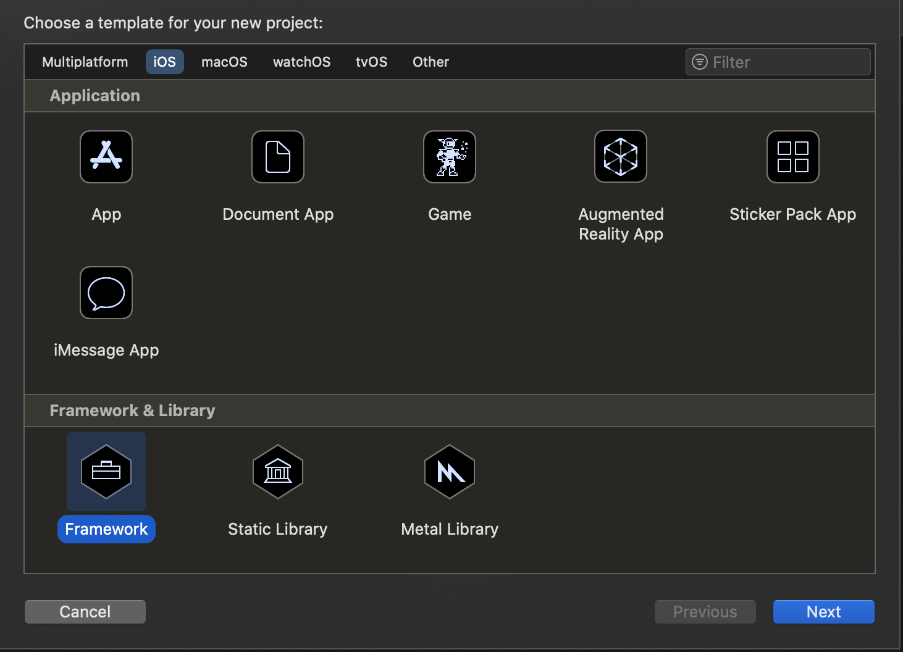

# Modular Architecture on iOS
Building Large Scale Modular iOS Apps And Frameworks

# Dedication 
"To my Mom and Dad, because they really tried."

&&

"To all my non-tech friends whom I am fixing problems with not enough disk space, printers, forgotten passcodes etc."

&&

"To all passionate engineers who are solving tough problems on a daily basis with a smile, it is great pleasure for everyone to work with you!"

&&

"Finally, to whoever my current girlfriend is..."

# About the author
Cyril Cermak is a software engineer by heart and author of this book. Most of his professional career was spent by building iOS apps or iOS frameworks. Beginning by Skoda Auto Connect App in Prague, continuing building iOS platform for Freelancer Ltd in Sydney and as of now being an iOS TechLead in Stuttgart for Porsche AG. In this book, Cyril describes different approaches for building modular iOS architecture so as some mechanisms and essential knowledge that should help you, the reader, to decide which approach would fit in the best or should be considered on your project.

## Reviewers
Joerg Nestele
... Ask Joerg whether he wants be the reviewer. 

# Table Of Contents
- Introduction 
  - What you need 
  - What is this book about 
  - What is this book NOT about 
  
  
- Modular Architecture 
  - Design 
  - Layers 
    - App Layer 
    - Domain Layer 
    - Service Layer 
    - Core Layer 
    - Shared Layer 
  - Example: International Space Station 
    - ISS Overview 
    - Cosmonaut 
    - Laboratory 
  - Conclusion 

  
- Frameworks on Apple's ecosystem
  - Dynamic framework vs static library
  - Essentials
  - Exposing static 3rd party library
  - Examining dynamic library
    - Fat headers
    - Dependencies
    - Symbols table
    - Strings
  - Linker and Compiler
  - X86_64 and ARM  

    
- Development
  - Scalability
  - Workflow
  - Ground Rules
  - Application Framework
    - Distribution 
    - The Software Foundation


- Design Patterns
  - Configurations
  - Coordinators
  - Decoupling
  - MVVM
  - Clean Architecture
  - Protocols
    
    
- Dependency Managers
  - Cocopods
  - Carthage
  - SwiftPM
    
    
- Development
  - Dynamic CocoaTouch Framework
  - Workspace and projects
      - xcodegen
  - Contributions 
    - Mono-repository 
    - Versionised frameworks
  - Common Problems
  - Handling Secrets
    - Mobile Secrets
  
  
- Distribution
  - Frameworks
  - XCFrameworks
  - Static Library
  - Open sourcing
  
  
- Project Automation
  - Motivation
  - Fastlane
  - Translations, Stages, Configurations etc.
  - Ruby


- CI/CD
  - Scripts execution


- GitFlow


- Profesional Experience
  - Joerg Nestele: iOS Tech Lead - Porsche AG
  - Majd Alfhailly: Senior iOS Engineer - Blinkst
  - Daniel Williams: Senior iOS Engineer - Canva
  - Aldrich Co: iOS Tech Lead - Freelancer Ltd.
  - Gleb Arkhipov: iOS Tech Lead - STRV
  
# Introduction

In the software engineering field, people are going from project to project, gaining different kind of experience out of it. Especially, on iOS mostly the monolithic approaches are used. In some cases it makes totally sense, so nothing against it. However, scaling up the team, or even better, team of teams on monolithically built app is horrifying and nearly impossible without some major time impacts on a daily basis. Numerous problems will rise up, that are limiting the way how iOS projects are built itself or even on the organisational. 

Scaling up the monolithic approach to a team of e.g 7+ developers will most likely result in hell. By hell, I mean, resolving xcodeproj issues, where in the worst case both parties renamed or edited and deleted the same file, touched the same {storyboard|xib} file, or typically both worked on the same file which would resolve in classic merge conflicts. Somehow, those issues we all got used to live with...

The deal breaker will come when your PO/PM/CTO will come to the team to announce that they are planning to release a new flavour of the app or to divide the current app into two separate parts. Afterwards, the engineering decision needs to be made. Either, to continue with this monolithic approach, create different targets, assign files towards the new flavour of the app and continue living in multiplied hell and hoping that some requirement such as shipping core components of the app to a subsidiary or open-sourcing it as a framework will not come. 

Not surprisingly, a better approach would be to start refactoring the app into a modular approach, where each team can be responsible for particular frameworks (parts of the app) that are then linked towards those apps. That will take time as it will not be easy to transform but the future of company's mobile engineering will be faster, scalable, maintainable and even ready to distribute or open source some parts of it to the outer world.  

Another scenario could be, that you are already working on an app which is done in a modular way but your app takes at around 20 mins to compile. As it is a huge legacy codebase that was in development past 8 or so years and linked every possible 3rd party library along the way. The decision was made to modularise it with Cocoapods therefore, you cannot link easily already pre-compiled libraries with Carthage and every project clean you can take double shot of espresso. I had been there, trust me, it is another type of hell, definitely not a place where anyone would like to be. I described the whole migration process of such project [here](https://medium.com/freelancer-engineering/modular-architecture-on-ios-and-how-i-decreased-build-time-by-50-23c7666c6d2f). Of course, in this book you will read about it in more detail.

Nowadays, as an iOS tech lead, I am often getting asked some questions all over again from new teams or new colleagues regards those topics. Thereafter, I decided to sum it up and tried to get the whole subject covered in this book. I hope it will help developers working on such architectures to gain the speed, knowledge and understanding faster.

I hope this introduction gave enough motivation to deep dive further into this book.

## What you Need

The latest version of Xcode for compiling the demo examples, brew to install some mandatory dependencies, Ruby and Bundler for running scripts and downloading some Ruby gems. 

//TODO: Provide a tutorials for installing those softwares 

## What is this book about
This book describes essentials about building modular architecture on iOS. You will find examples of different approaches, framework types, pros and cons, common problems and so on. By the end of this book you should have a very good understanding of what benefits will bring such architecture to your project, whether it is necessary at all or which would be the best way for modularising the project.

At the end of this book, you can read experiences from the top notch iOS engineers working across numerous different projects from different countries and continents.

## What is this book NOT about
SwiftUI.


# Modular Architecture
<b>Modular</b>

   <i>`adjective - employing or involving a module or modules as the basis of design or construction: "modular housing units"`</i>
      
 In the introduction, I briefly touched the motivation for building the project in the modular way. To summaries it, modular architecture will give you much more freedom when it comes to the product decisions that will influence the overall app engineering. Such as, building another app for the same company, open-sourcing some parts of the existing codebase, scaling the team of developers and so on. With the already existing mobile foundation, it will be done way faster and cleaner.  
 
 To be fair, maintaining such software foundation of a company might be also really difficult. By maintaining, I mean, taking care of the CI/CD, old projects developed on top of the foundation that was heavily refactored in the meantime, legacy code, keeping it up-to date with the latest development tools and so on. No need to say, that on a very large project, this could be a work of one standalone team.
 
 This book describes different approaches of building such large scalable project by an example: The software foundation for the [International Space Station](https://en.wikipedia.org/wiki/International_Space_Station).
 
## Design
In this book, I chose to use the architecture that I think is the most evolved. It is a five layer architecture that consists of those layers:

- Application
- Domain
- Service
- Core
- Shared

Each layer is explained in the following chapter.

Nevertheless, the same principles can be applied for example for feature oriented architecture, where the layers could be defined as: 

- Application
- Feature
- Core
- Shared

Now let us have a look on what those layers will consist of.
## Layers
Let us have a look now on each layer and its purpose. Modules within the layers are then demonstrated with the example in the following chapter.

### Application Layer
Application layer consists of the final customer facing products; applications. Applications are linking domains and via configurations and Scaffold module glueing all the different parts together. In such architecture, the App is basically a container that puts pieces together. 

Nevertheless, App might also contain some necessary Application implementations like receiving push notifications, handling deep linking, permissions and so on.

Patterns, that will help achieve such goals will be described later.   

For example an app in an e-commerce business could be `The Shop` for online customer and `Cashier` for the employees of that company.

### Domain Layer
Domain layer links services and other modules from layers below and uses them to implement business domain needs of the company or the project. Domains will contain for example the users flow within the particular domain part of the app. So as, the necessary components for it like; view controllers, views, models and view models. No need to say, that it depends on the teams preferences and technical experience which pattern will be used for creating screens. Personally, the reactive MVVM+C is my favourite but more on that later.  

For example a domain in an e-commerce app could be a `Checkout` or `Store Items`.   

### Service Layer
Services are modules supporting domains. Each domain, can link several services in order to achieve desired outcomes. Such service will most likely talk to the backend, get the data out of it, persist them in its own storage and expose them to domains.   

For example a service in an e-commerce app could be a `Checkout Service` which will handle all the necessary communication with the backend so as proceeding with the credit card payments etc.
   
### Core Layer
Core layer is the enabler for the whole app. Services will link the necessary modules out of it for e.g communicating with the backend or persisting the data. Domains will link e.g ui components for easier implementation o  screens and so on.

For example a core module in an e-commerce app could be `Network` or `UIComponents`

### Shared Layer
Shared layer is a supporting layer for the whole framework. It can happen that this layer might not need to exist. However, a perfect example for the shared layer is logging. Where even core layer modules will want to log some output. That would potentially lead to duplicates, which could be solved by the shared layer. 
  
For example a shared module in an e-commerce app could be `Logging` or `AppAnalytics`

## Example: International Space Station

Now in this example, let us have a look at how such architecture could really look like for [International Space Station](https://en.wikipedia.org/wiki/International_Space_Station). Diagram below shows the four layer architecture with the modules and linking. 

While this chapter is rather theoretical, in the following chapter everything will be explained and showcased in practice.  

 

The example has three applications. 
- `ISS Overview`: app that shows astronauts the overall status of the space station
- `Cosmonaut`: app where Cosmonaut can control his spacesuit so as his supplies and personal information
- `Laboratory`: app from which the laboratories on the space station can be controlled 

As described above, all apps are linking Scaffold module which provides the bootstrapping for the app as the app itself is the container.

### ISS Overview
`ISS Overview` app links `Peripheries` domain which implements logic and screens for peripheries of the station.  

The `Peripheries` domain links `Heat Radiator`, `Solar Array` and `Docking Port` services from whom the data about those peripheries are gathered so as `UIComponents` for bootstrapping the screens development. 

Linked services are using `Network` and `Radio` core modules which are providing the foundation for the communication with other systems via network protocols. `Radio` in this case could implement some communication channel via BLE or other technology which would connect to the solar array or heat radiator. Diagram below describes the concrete linking of modules for the app.

 
 
 
### Cosmonaut
`Cosmonaut` app links `Spacesuit` and `Cosmonaut` domains. Same as for every other domain, each module is responsible for screens and users flow through the part of the app.

`Spacesuit` and `Cosmonaut` domains link `Spacesuit` and `Cosmonaut` services that are providing data for domain defined screens so as `UIComponents` who are providing the UI parts.


`Spacesuit` service is using `Radio` for communication with cosmonauts spacesuit via BLE or other type of radio technology. `Cosmonaut` service is using `Network` for updating Huston about the current state of the `Cosmonaut` so as `Persistence` for storing the date of the cosmonaut for offline usage. 

 
### Laboratory

I will leave this one for the reader to figure it out. 
 
## Conclusion

As you can probably imagine, scaling of the architecture described above should not be a problem. When it comes to extending for example the ISS Overview app for another ISS periphery, a new domain module can be easily added with some service modules etc. 

When a requirement comes for creating a new app for e.g. cosmonauts, the new app can already link the battlefield tested Cosmonaut domain module with other necessary modules that are required. Development of the new app will become way more easier due to that.

The knowledge of the software remains in one repository or one project where developers have access to and can learn from is also very beneficial.         

There are of course some disadvantages as well. For example, onboarding new developers on such architecture might take a while, especially when there is already huge existing codebase. There, the pair programming comes into play. So as, proper project onboarding, software architecture documents and the overall documentation of modules and the whole project.

   
# Libraries on Apple's ecosystem

Before we deep dive into the development of previously described architecture there is some essential knowledge that needs to be explained. Especially, the type of library that is going to be used for building such project and its behaviour.

In Apple's ecosystem as of today we have two main options when it comes to creating a library. The library can either be statically or dynamically linked. Dynamic library previously known as `Cocoa Touch Framework`,  nowadays simplified to `Framework` and the statically linked, the `Static Library`.

 

**What is a library?**

To quote Apple:
*"Libraries define symbols that are not built as part of your target."*

What are symbols?
*Symbols reference to chunks of code or data within binary.*

**Types of libraries:**

1) Dynamicaly linked
  - **Dylib**: Library that has its own Mach-O (explained later) binary. (`.dylib`)
  - **Framework**: Framework is a bundle that contains the binary and other resources the binary might need during the run time. (`.framework`)
  - **TBDs**: Text Based Dynamic Library Stubs is a text stubbed library around a binary without including it as the binary resides on the target system, used by Apple to ship lightweight SDKs for development. 
  - **XCFramework**: From Xcode 11 the XCFramework was introduced which allows to group a set of frameworks for different platforms e.g `macOS`, `iOS`, `iOS simulator`,`watchOS` etc.

2) Statically linked
  - **Archive**: Archive of a compiler produced object files with object code. (`.a`)
  - **Framework**: Framework contains the static binary or static archive with additional resources the library might need. (`.framework`)
  - **XCFramework**: Same as for dynamically linked library the XCFramework can be used with statically linked.

We can look at a framework as some bundle that is standalone and can be attached to a project with its own binary. Nevertheless, the binary cannot run by itself, it must be part of some target. 

## Dynamic vs static library?

The main difference between a static library and a framework is in the Inversion Of Control (IoC) and how they are linked towards the main executable. When you are using something from a static library, you are in control of it as it becomes part of the main executable during compilation. On the other hand when you are using something from a framework you are passing responsibility for it to the framework as framework is dynamically linked on the app start to the executable process. I’ll delve more into IoC in the paragraph below. Static libraries, at least on iOS, cannot contain anything other than the executable code. A framework can contain everything you can think of e.g storyboards, xibs, images and so on…

As mentioned above, the way framework code execution works is slightly different than in a classic project or a static library. For instance, calling a function from the framework is done through a framework interface. Let’s say a class from a framework is instantiated in the project and then a specific method is called on it. When the call is being done you are passing the responsibility for it to the framework and the framework itself then makes sure that the specific action is executed and the results then passed back to the caller. This programming paradigm is known as Inversion Of Control. Thanks to the umbrella file and module map you know exactly what you can access and instantiate from the framework after the framework compilation.

A framework does not support any Bridging-Header file; instead there is an umbrella.h file. An umbrella file should contain all Objective-C imports as you would normally have in the bridging-Header file. The umbrella file is basically one big interface for the framework and it is usually named after the framework name e.g myframework.h. If you do not want to manually add all the Objective-C headers, you can just mark .h files as public. Xcode generates headers for ObjC for public files when compiling. It does the same thing for Swift files as it puts the ClassName-Swift.h into the umbrella file and exposes the Swift publicly available interfaces via swiftmodule definition. You can check the final umbrella file and swiftmodule under the derived data folder of the compiled framework.

No need to say, classes and other structures must be marked as public to be visible outside of a framework. Not surprisingly, only files that are called outside of the framework should be exposed.

**PROS & CONS**

## Essentials

When building any kind of modular architecture, it is crucial to keep in mind that a static library is attached to the executable while dynamic one is opened and linked at the start time. Thereafter, if there are two frameworks linking the same static library the app will launch with warnings `Class loaded twice ... one of them will be used.` issue. That causes much slower app start as the app needs to decide which of those classes will be used. So as, in the worst case when two different versions of the same static library are used the app will use them interchangeably. The debugging will become a horror if that case happens that being said, it is very important to be sure that the linking was done right and no warnings appears.   

All that is the reason why using dynamically linked frameworks for internal development is the way to go. However, working with static libraries is unfortunately inevitable especially when working with 3rd party libraries. Big companies like Google, Microsoft or Amazon are using static libraries for distributing their SDKs. For example: `GoogleMaps`, `GooglePlaces`, `Firebase`, `MSAppCenter` and all subset of those SDKs are linked statically. 

When using 3rd party dependency manager like Cocoapods for linking one static library attached to more than one project (App and Framework) it would fail the installation with `target has transitive dependencies that include static binaries`.

Let's have a look how to link such static library into a dynamically linked SDK. 

## Exposing static 3rd party library

It takes extra effort to link the static library into a dynamically linked projects correctly. The crucial part is to make sure that it is linked only at one place. Either towards one dynamic framework where the static library can be exposed via umbrella file and then everywhere where the framework is linked the static library can be accessed through it as well. Or, towards the app target from where it cannot be exposed anywhere else but via some level of abstraction it can be passed through to other frameworks on the code level.

As an example of such umbrella file exposing GoogleMaps library that was linked to it could be:

```ObjC
// Framework.h - Umbrella file
#import <UIKit/UIKit.h>
#import "GoogleMaps/GoogleMaps.h"
```      

The import of the header file of `GoogleMaps` into the frameworks umbrella file exposes all public headers of the GoogleMaps because of the `GoogleMaps.h` has all the GoogleMaps public headers.

```ObjC
// GoogleMaps.h
#import "GMSIndoorBuilding.h"
#import "GMSIndoorLevel.h"
#import "GMSAddress.h"
...
``` 

From now on it is sufficient to link and import the Framework which allows then direct access to the static GoogleMaps library.

## Examining library

Let us have a look at some of the commands that comes in handy when solving some problems when it comes to compiler errors or receiving compiled closed source framework or a library. To give it a quick start let's have a look at a binary we all know very well; UIKit. The path to the UIKit.framework is: `/Applications/Xcode.app/Contents/Developer/Platforms/iPhoneOS.platform/Library/Developer/CoreSimulator/Profiles/Runtimes/iOS.simruntime/Contents/Resources/RuntimeRoot/System/Library/Frameworks/UIKit.framework`

Apple ships various different tools for exploring compiled libraries and frameworks. On the UIKit framework I will demonstrate only essential commands that I find useful quite often.

### Mach-O file format

Before we start, it is useful to know what we are going to be exploring. In Apple ecosystem, file format of any executable is called Mach-O (Mach object). Mach-O has a pre-defined structure starting with Mach-O header following by segments, sections, load commands etc.  

Since you are surely a curious reader, you are now having tons of questions about where it all comes from. The answer to that is quite simple. Since it is all part of the system you can open up Xcode and look for a file in a global path `/usr/include/mach-o/loader.h`. In the `loader.h` file for example the Mach-O header struct is defined.

```c++
/*
 * The 64-bit mach header appears at the very beginning of object files for
 * 64-bit architectures.
 */
struct mach_header_64 {
	uint32_t	magic;		/* mach magic number identifier */
	cpu_type_t	cputype;	/* cpu specifier */
	cpu_subtype_t	cpusubtype;	/* machine specifier */
	uint32_t	filetype;	/* type of file */
	uint32_t	ncmds;		/* number of load commands */
	uint32_t	sizeofcmds;	/* the size of all the load commands */
	uint32_t	flags;		/* flags */
	uint32_t	reserved;	/* reserved */
};
```

When compiler produces final executable the Mach-O header is placed at a concrete byte position in it. Therefore, tools that are working with the executables knows exactly where to look for desired information. The same principle applies to all other parts of Mach-O as well.  

`// TODO: Redirect to an article or explain here?`

For further exploration of Mach-O file, I would recommend reading the following [article](https://medium.com/@cyrilcermak/exploring-ios-es-mach-o-executable-structure-aa5d8d1c7103.).

### Fat headers

First, let's have a look on what Architectures the binary can be linked on. For that, we are going to use `otool`;the utility that is shipped within every macOS. To list fat headers of a compiled binary we will use the flag `-f` and to produce a symbols readable output I also added the `-v` flag.

```shell
otool -fv ./UIKit
```
Not surprisingly, the output produces two architectures. One that runs on the Intel mac (`x86_64`) when deploying to simulator and one that runs on iPhones so as on recently introduced M1 mac (`arm64`). 
```
Fat headers
fat_magic FAT_MAGIC
nfat_arch 2
architecture x86_64
    cputype CPU_TYPE_X86_64
    cpusubtype CPU_SUBTYPE_X86_64_ALL
    capabilities 0x0
    offset 4096
    size 26736
    align 2^12 (4096)
architecture arm64
    cputype CPU_TYPE_ARM64
    cpusubtype CPU_SUBTYPE_ARM64_ALL
    capabilities 0x0
    offset 32768
    size 51504
    align 2^14 (16384)
```

When the command finishes successfully while not printing any output it simply means that the binary does not contain the fat header. That being said, the library can run only on one architecture and to see what the architecture is we have to print out the mach-o header of the executable.

```shell
otool -hv ./UIKit
```
From the output of the Mach-O header we can see that the `cputype` is `X86_64` so as some extra information like which `flags` the library was compiled with, `filetype` and so on.
```
Mach header
      magic cputype cpusubtype  caps    filetype ncmds sizeofcmds      flags
MH_MAGIC_64  X86_64        ALL  0x00       DYLIB    21       1400   NOUNDEFS DYLDLINK TWOLEVEL APP_EXTENSION_SAFE
```

### Executable type

Second, let us determine what type of a library we are dealing with. For that we will use again the `otool` as mentioned above Mach-O header specifies `filetype`. So running it again on the UIKit.framework with the `-hv` flags produces the following output:  

```
Mach header
      magic cputype cpusubtype  caps    filetype ncmds sizeofcmds      flags
MH_MAGIC_64  X86_64        ALL  0x00       DYLIB    21       1400   NOUNDEFS DYLDLINK TWOLEVEL APP_EXTENSION_SAFE
```
From the output's `filetype` we can see that it is a dynamically linked library. Well, not surprisingly as the extension of the library is `.framework`. Nevertheless, there are some exceptions. The perfect example of that is `GoogleMaps.framework`. When running the same command on the executable of `GoogleMaps` from the output we can see that the executable is NOT dynamically linked but its type is `OBJECT` aka object files which means that the library is static and linked to the attached executable at the compile time.

```
Mach header
      magic cputype cpusubtype  caps    filetype ncmds sizeofcmds      flags
MH_MAGIC_64  X86_64        ALL  0x00      OBJECT     4       2688 SUBSECTIONS_VIA_SYMBOLS
```
I am guessing that the reason for wrapping the static library into a framework was the necessary include of `GoogleMaps.bundle` which needs to be copied to the target in order the library to work correctly.

Now let's try to run the same command on the static library. As an example we can use again one of the Xcode's libraries located at `/Applications/Xcode.app/Contents/Developer/Toolchains/XcodeDefault.xctoolchain/usr/lib/swift/iphoneos/libswiftCompatibility50.a` path. From the library extension we can immediately say the library is static. Running the `otool -hv libswiftCompatibility50.a` just confirms that the `filetype` is `OBJECT`.

```
Archive : ./libswiftCompatibility50.a (architecture armv7)
Mach header
      magic cputype cpusubtype  caps    filetype ncmds sizeofcmds      flags
   MH_MAGIC     ARM         V7  0x00      OBJECT     4        588 SUBSECTIONS_VIA_SYMBOLS
Mach header
      magic cputype cpusubtype  caps    filetype ncmds sizeofcmds      flags
   MH_MAGIC     ARM         V7  0x00      OBJECT     5        736 SUBSECTIONS_VIA_SYMBOLS
...
```

While library ending with `.a` is clearly static one with a framework to be really sure that the library is dynamically linked it is better to check the executable for its `filetype`.

### Dependencies
Third, let's have a look at what the library is linking. For that the otool provides `-l` flag.
```shell
otool -L ./UIKit
```
The output lists all dependencies of that framework. For example, here you can see that UIKit is linking `Foundation`. That's why the `import Foundation` is no longer needed when importing UIKit into a source code file.

```
./UIKit:
	/System/Library/Frameworks/UIKit.framework/UIKit (compatibility version 1.0.0, current version 3987.0.109)
	/System/Library/Frameworks/FileProvider.framework/FileProvider (compatibility version 1.0.0, current version 1.0.0, reexport)
  /System/Library/Frameworks/Foundation.framework/Foundation (compatibility version 300.0.0, current version 1751.108.0)
  /System/Library/PrivateFrameworks/DocumentManager.framework/DocumentManager (compatibility version 1.0.0, current version 200.0.0, reexport)
	/System/Library/PrivateFrameworks/UIKitCore.framework/UIKitCore (compatibility version 1.0.0, current version 3987.0.109, reexport)
	/System/Library/PrivateFrameworks/ShareSheet.framework/ShareSheet (compatibility version 1.0.0, current version 1564.6.0, reexport)
	/usr/lib/libobjc.A.dylib (compatibility version 1.0.0, current version 228.0.0)
	/usr/lib/libSystem.B.dylib (compatibility version 1.0.0, current version 1292.0.0)
```

### Symbols table

Fourth, it is also useful to know what are the symbols that are defined in the framework. For that the `nm` utility is available. To print all symbols including the debugging ones I added `-a` flag so as to print them demangled `-C`. 
```shell
nm -Ca ./UIKit
```
Unfortunately, the output here is very limited as those symbols listed are the ones that defines the framework itself. The limitation is because of Apple ships the binary obfuscated and when reverse engineering the binary with for example Radare2 disassembler, all we can see is couple of `add byte` assembly instructions. It is still possible to dump the list of symbols but for that we would have to either use `lldb` and have the UIKit framework loaded in the memory space or dump the memory footprint of the framework and explore it decrypted. That is unfortunately not part of this book.
```
0000000000000ff0 s _UIKitVersionNumber
0000000000000fc0 s _UIKitVersionString
                 U dyld_stub_binder
```
Just to give an example how the symbols would look like I printed out compiled realm framework by running `nm -Ca ./Realm`. 
```
...
00000000002c4650 T realm::Table::do_move_row(unsigned long, unsigned long)
00000000002cb1e8 T realm::Table::do_set_link(unsigned long, unsigned long, unsigned long)
00000000004305e0 S realm::Table::max_integer
00000000004305e8 S realm::Table::min_integer
00000000002c44b4 T realm::Table::do_swap_rows(unsigned long, unsigned long)
00000000002ce9bc T realm::Table::find_all_int(unsigned long, long long)
00000000002cb3ac T realm::Table::get_linklist(unsigned long, unsigned long)
00000000002c4d64 T realm::Table::set_subtable(unsigned long, unsigned long, realm::Table const*)
00000000002ba4f0 T realm::Table::add_subcolumn(std::__1::vector<unsigned long, std::__1::allocator<unsigned long> > const&, realm::DataType, realm::StringData)
00000000002bd9f8 T realm::Table::create_column(realm::ColumnType, unsigned long, bool, realm::Allocator&)
00000000002bf3fc T realm::Table::discard_views()
...
```
It seams like Realm was developed in C++ so one more example for Swift with Alamofire. There we can unfortunately see that the `nm` was not able to demangle the symbols.  
```
...
0000000000034d00 T _$s9Alamofire7RequestC8delegateAA12TaskDelegateCvM
0000000000034dc0 T _$s9Alamofire7RequestC4taskSo16NSURLSessionTaskCSgvg
0000000000034e20 T _$s9Alamofire7RequestC7sessionSo12NSURLSessionCvg
0000000000034e50 T _$s9Alamofire7RequestC7request10Foundation10URLRequestVSgvg
00000000000350c0 T _$s9Alamofire7RequestC8responseSo17NSHTTPURLResponseCSgvg
00000000000351e0 T _$s9Alamofire7RequestC10retryCountSuvpfi
...
```
To demangle swift manually following command can be used.
```shell
nm -a ./Alamofire | awk '{ print $3 }' | xargs swift demangle {} \;
```
Which produces the mangled name with the demangled explanation.
```
...
_$s9Alamofire7RequestC4taskSo16NSURLSessionTaskCSgvg ---> Alamofire.Request.task.getter : __C.NSURLSessionTask?
_$s9Alamofire7RequestC4taskSo16NSURLSessionTaskCSgvgTq ---> method descriptor for Alamofire.Request.task.getter : __C.NSURLSessionTask?
_$s9Alamofire7RequestC10retryCountSuvpfi ---> variable initialization expression of Alamofire.Request.retryCount : Swift.UInt
...
```

### Strings

Last but not least, it can be also helpful to list all strings that the binary contains. That could help catch developers mistakes like not obfuscated secrets etc. To do that we will use `strings` utility.
```shell
strings ./Alamofire
```
The output is a list of plain text strings found in the binary.
```
...
Could not fetch the file size from the provided URL:
The URL provided is a directory:
The system returned an error while checking the provided URL for
reachability.
URL:
The URL provided is not reachable:
...
```

## Compiler and Linker

## In conclusion
I hope this chapter gave the essentials of what is the difference in between static and dynamic library so as some examples of how to examine the dynamic one. It was quite a lot to grasp so now it's time for a double shot of espresso or any kind of preferable refreshment.

I would highly recommend to deep dive into this topic even more. Here are some resources I would recommend; 

How does the executable structure looks like:
https://medium.com/@cyrilcermak/exploring-ios-es-mach-o-executable-structure-aa5d8d1c7103

Difference in between static and dynamic library from our beloved StackOverflow:
https://stackoverflow.com/questions/15331056/library-static-dynamic-or-framework-project-inside-another-project

The official Apple documentation about dynamic libraries:
https://developer.apple.com/library/archive/documentation/DeveloperTools/Conceptual/DynamicLibraries/000-Introduction/Introduction.html#//apple_ref/doc/uid/TP40001908-SW1


 