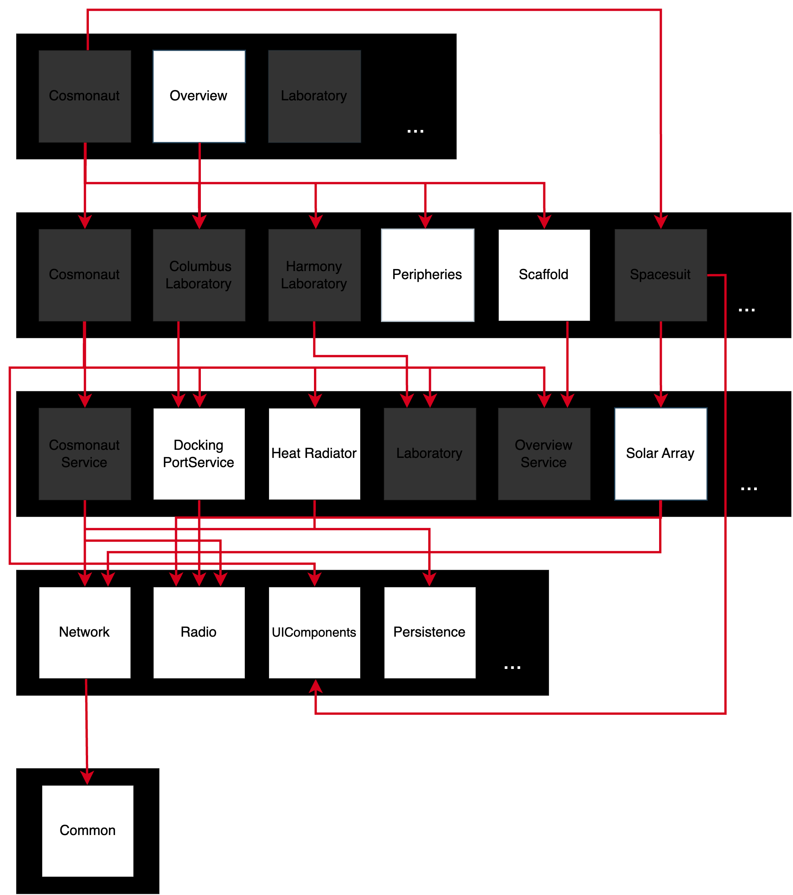

---
title: "Modular Architecture on iOS/macOS"
author: [Cyril Cermak]
date: "23.3.2021"
subject: "Domain driven design development"
keywords: [Markdown, Example]
subtitle: "Building large scalable iOS apps and frameworks with Domain Driven Design"
lang: "en"
titlepage: true,
titlepage-rule-heigh: 0
toc-own-page: true
disable-header-and-footer: true
footer-left: Modular Architecture on iOS/macOS
titlepage-background: "assets/cover.png"
linkcolor: black
toccolor: black
urlcolor: cyan
...

\newpage
# Modular Architecture on iOS and macOS

Building large scalable iOS/macOS apps and frameworks with Domain-Driven Design

\newpage
# Dedication
"To my Mom and Dad, because they really tried."

&&

"To all my non-tech friends for whom I am always fixing various problems: not enough disk space, printers not working, forgotten passcodes etc., and who will never read this line."

&&

"To all passionate engineers who are solving tough problems on a daily basis with a smile. It is great pleasure for everyone to work with you!"

&&

"Finally, to my current girlfriend … whoever you might be"

\newpage

# About the author
Hi, I am Cyril, a software engineer by heart and the author of this book. Most of my professional career was spent building iOS apps or iOS frameworks. My professional career began at Skoda Auto Connect App in Prague, continued for Freelancer Ltd in Sydney building iOS platform (TODO: building an iOS platform / build iOS platforms), included numerous start-ups along the way, and, currently, has me as an iOS TechLead in Stuttgart for Porsche AG. In this book, I am describing different approaches for building modular iOS architectures and will be providing some mechanisms and essential knowledge that should help one decide which approach would fit the best or should be considered for a project.

## Reviewers
?

\newpage
\tableofcontents
\newpage

# Introduction
In the software engineering field, people are going from project to project, gaining a different kind of experience out of it. In particular, on iOS, mostly the monolithic approaches are used. In some cases it makes total sense, so nothing against it. However, scaling up the team, or even better, the team of teams on a monolithically built app is horrifying and nearly impossible without some major time impacts on a daily basis. Numerous problems will rise, that limit the way iOS projects are built or managed at the organisational level.

Scaling up the monolithic approach to a team of e.g 10+ developers will most likely result in hell. By hell, I mean, resolving xcodeproj issues, where in the worst case, both parties renamed, edited, or deleted the same source code file or touched the same {storyboard|xib} file. That is, both worked on the same file which would resolve in classic merge conflicts. Somehow, we all become accustomed to those issues and have learned we will just need to live with them.

The deal-breaker comes when your PO/PM/CTO/CEO or anybody higher on the company's food chain than you are will come to the team to announce that they (TODO: he/she is) are planning to release a new flavour of the app or to divide the current app into two separate parts. Afterwards, the engineering decision needs to be made to either continue with the monolithic approach or implement something different. Continuing with the monolithic approach, likely would result in creating different targets, assigning files towards the new flavour of the app and continuing on living in multiplied hell all the while hoping that some requirement such as shipping core components of the app to a subsidiary or open-sourcing it as a framework will not come into play.

Not surprisingly, a better approach would be to start refactoring the app using a modular approach, where each team can be responsible for particular frameworks (parts of the app) that are then linked towards final customer-facing apps. That will most certainly take time as it will not be easy to transform it but the future of the company's mobile engineering will be faster, scalable, maintainable and even ready to distribute or open-source some SDKs of it to the outer world.

Another scenario could be that you are already working on an app that is set up in a modular way but your app takes around 20 mins to compile because it is a huge legacy codebase that has been in development for the past eight or so years and has linked every possible 3rd party library along the way. The decision was made to modularise it with Cocoapods therefore, you cannot link easily already pre-compiled libraries with Carthage and every project clean means you can take a double shot of espresso. I have been there, trust me, it is another type of hell, definitely not a place where anyone would like to be. I described the whole migration process of such a project [in an article on Medium in 2018](https://medium.com/freelancer-engineering/modular-architecture-on-ios-and-how-i-decreased-build-time-by-50-23c7666c6d2f). Of course, in this book you will read about it in more detail.

Nowadays, as an iOS tech lead (TODO: previous mention of iOS TechLead used a different formatting), I am often getting asked some questions all over again from new teams or new colleagues with regards to those topics. Thereafter, I decided to sum it up and tried to get the whole subject covered in this book. The purpose of it is to help developers working on such architectures to gain the speed, knowledge, ideas and understanding faster (TODO: reword the end of this sentence; to gain the background knowledge and experience in order to more quickly and correctly implement these ideas).

Hopefully, this introduction provided enough motivation that you will want to dive further into this book.

## What you Need

The latest version of [Xcode](https://apps.apple.com/us/app/xcode/id497799835?mt=12) for compiling the demo examples, [brew](https://brew.sh/) to install some mandatory dependencies, [Ruby](https://www.ruby-lang.org/en/), and [bundler](https://bundler.io/) for running scripts and downloading some ruby gems.

## What is this book about
This book describes the essentials of building a modular architecture on iOS. You will find examples of different approaches, framework types, their pros and cons, common problems and so on. By the end of this book, you should have a very good understanding of what benefits such an architecture will bring to your project, whether it is necessary at all, and which way would be the best for modularising the project.

At the end of this book, you can read about the experience from the top-notch iOS engineers working across numerous different projects from different countries and continents.

## What is this book NOT about
SwiftUI.

\newpage
# Modular Architecture
  **Modular**, *adjective - employing or involving a module or modules as the basis of design or construction: "modular housing units"*

In the introduction, I briefly touched on the motivation for building the project in a modular way. To summarise, modular architecture will give us much more freedom when it comes to the product decisions that will influence the overall app engineering. These include building another app for the same company, open-sourcing some parts of the existing codebase, scaling the team of developers, and so on. With the already existing mobile foundation, it will be done way faster and cleaner.
[//]: # (TODO: what will be done way faster and cleaner)

To be fair, maintaining such a software foundation of a company might be also really difficult. By maintaining, I mean, taking care of the CI/CD
[//]: # (TODO: spell these out the first time they are used)
, maintaining old projects developed on top of the foundation that was heavily refactored in the meantime, legacy code, keeping it up-to-date with the latest development tools and so on. It goes without saying that on a very large project, this could be the work of one standalone team.

This book describes building such a large scalable architecture with domain-driven design and does so by using examples; The software foundation for the [International Space Station](https://en.wikipedia.org/wiki/International_Space_Station).

## Design
In this book, I chose to use the architecture that I think is the most evolved. It is a five-layer architecture that consists of the following layers:

- Application
- Domain
- Service
- Core
- Shared

Each layer is explained in the following chapter.

Nevertheless, the same principles can be applied for other architectural types as well. An example is a feature-oriented architecture where the layers could be defined as follows:

- Application
- Feature
- Core
- Shared

Now to the specific layers.

## Layers
Let us have a look now at each layer and its purpose. Modules within layers are then demonstrated with the example in the following chapter.

### Application Layer
The application layer consists of the final customer-facing products: applications. Applications glue all  the different parts together, linking domains via configurations and a Scaffold module. In such architecture, the App is a container that puts pieces together.

Nevertheless, the App might also contain some necessary Application implementations like receiving push notifications, handling deep linking, requesting permissions, and so on.

Patterns that will help achieve such goals will be described later.

For example, an app in an e-commerce business could be `The Shop` for online customer and `Cashier` for the employees of that company.

### Domain Layer
Domain layer links services and other modules from layers below and uses them to implement the business domain needs of the company or the project. Domains will contain, for example, the user flow within the particular domain part of the app. So as, the necessary components for it like; view controllers, views, models and view models (TODO: reword this sentence). Obviously it depends on the team's preferences and technical experience which pattern will be used for creating screens. Personally, the reactive MVVM+C is my favourite but more on that later.

Continuing with our example of an e-commerce app, a domain could be `Checkout` or `Store Items`.

### Service Layer
Services are modules supporting domains. Each domain can link several services to achieve desired outcomes. Such services will most likely talk to the backend, obtaining data from it, persisting the data in its storage, and exposing the data to domains.

A service in our theoretical e-commerce app could be a `Checkout Service`. This service would handle all of the necessary communication with the backend so as to proceed with the credit card payments etc.

### Core Layer
The core layer is the enabler for the whole app. Services will link the necessary modules out of it for e.g communicating with the backend or providing a general abstraction of persisting the data. Domains will link e.g UI components for easier implementation of screens and so on.

A core module in our e-commerce app could be `Network` or `UIComponents`.

### Shared Layer
The shared layer is a supporting layer for the whole framework. It can happen that this layer might not need to exist, therefore, it is not considered in all diagrams. However, a perfect example of the shared layer is some logging mechanism. Even core layer modules may want to log some output and that could potentially lead to duplicates. This duplicated code could be solved by the shared layer.

For example, a shared module in an e-commerce app could be `Logging` or `AppAnalytics`.

## Example: International Space Station

Now in this example, we will have a look at how such architecture could look like for the [International Space Station](https://en.wikipedia.org/wiki/International_Space_Station). The diagram below shows the four-layer architecture with the modules and links.

While this chapter is rather theoretical, in the following chapters everything will be explained and showcased in practice.


The example has three applications.

- `ISS Overview`: app that shows astronauts the overall status of the space station
- `Cosmonaut`: app where a Cosmonaut can control his spacesuit as well as his supplies and personal information
- `Laboratory`: app from which the laboratories on the space station can be controlled

As described above, all apps link the Scaffold module which provides the bootstrapping for the app while the app itself behaves like a container.

### ISS Overview



The diagram above(TODO: will it always be above? from my LaTeX days, I learned to reference the images by reference number, allowing clicking on the link to be taken to the image) describes the concrete linking of modules for the app. Let us have a closer look at it.

`ISS Overview` app links the domain `Peripheries`, which implements logic and screens for peripheries of the station.

The `Peripheries` domain links the `Heat Radiator`, `Solar Array`, and `Docking Port` services from which data about those peripheries are gathered so as `UIComponents` for bootstrapping the screens' development.
(TODO: what is this about UIcomponents? Should I see an arrow from peripheries to uicomponents? or uicomponents component is pulled in via scaffold?)

The linked services use the `Network` and `Radio` core modules. These provide the foundation for the communication with other systems via network protocols. `Radio` in this case could implement some communication channel via BLE (TODO: spell it out? refer to a glossary?) or other technology which would connect to the solar array or heat radiator.

### Cosmonaut


The `Cosmonaut` app links the `Spacesuit` and `Cosmonaut` domains. This is the same for every other domain, each module is responsible for screens and users flow through the part of the app. (TODO: what is the same? each module=domain? handles its own UX flow?)

`Spacesuit` and `Cosmonaut` domains link `Spacesuit` and `Cosmonaut` services that provide data for domain-specifc screens as `UIComponents` provides the UI parts.

`Spacesuit` service is using `Radio` for communication with cosmonauts spacesuit via BLE or another type of radio technology. `Cosmonaut` service uses `Network` for updating Houston about the current state of the `Cosmonaut` and uses `Persistence` for storing the data of the cosmonaut for offline usage.


### Laboratory

I will leave this one for the reader to figure out.

## Conclusion

As you can probably imagine, scaling the architecture as described above should not be a problem. When it comes to extending the ISS Overview app for another ISS periphery, for example, a new domain module can be easily added with some service modules etc.

When a requirement comes for creating a new app for e.g. cosmonauts, the new app can already link the battlefield proven and tested Cosmonaut (TODO: did you want to use `Cosmonaut` formatting on these?) domain module with other necessary modules that are required. Development of the new app will thus become much easier.

The knowledge of the software that remains in one repository where developers have access to and can learn from is also very beneficial.

There are of course some disadvantages as well. For example, onboarding new developers on such an architecture might take a while, especially when there is already a huge existing codebase. In such a case, pair programming comes into play so as to provide proper project onboarding, software architecture documents and the overall documentation of modules and the whole project. (TODO: what about documents and overall documentation? those are things that help new developers? have to do with peer programming?)


\newpage
# Libraries on Apple's ecosystem

Before we deep dive into the development of previously described architecture, there is some essential knowledge that needs to be explained. In particular, we will need some background in the type of library that is going to be used for building such a project and its behaviour.

In Apple's ecosystem as of today, we have two main options when it comes to creating a library. The library can either be statically or dynamically linked. Previously known as `Cocoa Touch Framework`, the dynamically linked library is nowadays referred to simply as `Framework`. The statically linked library is known as the `Static Library`.


**What is a library?**

To quote Apple:
*"Libraries define symbols that are not built as part of your target."*

What are symbols?
*Symbols reference to chunks of code or data within binary.*

\newpage
**Types of libraries:**

1) Dynamicaly linked
  - **Dylib**: Library that has its own Mach-O (explained later) binary. (`.dylib`)
  - **Framework**: Framework is a bundle that contains the binary and other resources the binary might need during the runtime. (`.framework`)
  - **TBDs**: Text Based Dynamic Library Stubs is a text stubbed library (symbols only) around a binary without including it as the binary resides on the target system, used by Apple to ship lightweight SDKs for development. (`.tbd`)
  - **XCFramework**: From Xcode 11, the XCFramework was introduced which allows grouping a set of frameworks for different platforms e.g `macOS`, `iOS`, `iOS simulator`, `watchOS` etc. (`.xcframework`)

2) Statically linked
  - **Archive**: Archive of a compiler produced object files with object code. (`.a`)
  - **Framework**: Framework contains the static binary or static archive with additional resources the library might need. (`.framework`)
  - **XCFramework**: Same as for dynamically linked library the XCFramework can be used with statically linked. (`.xcframework`)

We can look at a framework as some bundle that is standalone and can be attached to a project with its own binary. Nevertheless, the binary cannot run by itself, it must be part of some runnable target. So what is exactly the difference?

## Dynamic vs static library?

The main difference between a static and dynamic library is in the Inversion Of Control (IoC) (TODO: well done, spelled it out - when introducing a new acronym that you later use) and how they are linked towards the main executable. When you are using something from a static library, you are in control of it as it becomes part of the main executable during the build process (linking). On the other hand, when you are using something from a dynamic framework you are passing responsibility for it to the framework as the framework is dynamically linked to the executable's process on app start. I’ll delve more into IoC in the paragraph below. Static libraries, at least on iOS, cannot contain anything other than the executable code unless they are wrapped into a static framework. A framework (dynamic or static) can contain everything you can think of e.g storyboards, XIBs, images and so on…

As mentioned above, the way dynamic framework code execution works is slightly different than in a classic project or a static library. For instance, calling a function from the dynamic framework is done through a framework's interface. Let’s say a class from a framework is instantiated in the project and then a specific method is called on it. When the call is being made, you are passing the responsibility for it to the dynamic framework and the framework itself then makes sure that the specific action is executed and the results then passed back to the caller. This programming paradigm is known as Inversion Of Control. Thanks to the umbrella file and module map you know exactly what you can access and instantiate from the dynamic framework after the framework was built.

A dynamic framework does not support any Bridging-Header file; instead, there is an umbrella.h file. An umbrella file should contain all Objective-C imports as you would normally have in the bridging-Header file. The umbrella file is one big interface for the dynamic framework and it is usually named after the framework name e.g `myframework.h`. If you do not want to manually add all the Objective-C headers, you can just mark `.h` files as public. Xcode generates headers for ObjC for public files when building. It does the same thing for Swift files as it puts the `ClassName-Swift.h` into the umbrella file and exposes the publicly available Swift interfaces via the swiftmodule definition. You can check the final umbrella file and swiftmodule under the derived data folder of the compiled framework.

On the other hand, a statically linked library is attached directly to the main executable during linking as the library contains already a pre-compiled archive of the source files with symbols. That being said, there is no need for an umbrella file as is the case with IoC in a dynamic framework.

It goes without saying that classes and other structures must be marked as public in order to be visible outside of a framework or a library. Not surprisingly, only objects that are needed for clients of a framework or a library should be exposed.

### PROS & CONS
Now let's have a look at some pros & cons of both.

**Dynamic:**

  - **PROS**
    - Faster app start time as a library is linked during app launch time or runtime, therefore the main executable has lesser memory footprint to load.
    - Can be opened on demand, therefore, might not get opened at all if user do not open specific part of the app (`dlopen`).
    - Can be linked transitively to other dynamic libraries without any difficulty.
    - Can be exchanged without the recompile of the main executable just by replacing the framework with a new version.
    - Is loaded into a different memory space than the main executable.
    - Can be shared in (TODO: in between?) between applications especially useful for system libraries.
    - Can be loaded partially, only the needed symbols can be loaded into the memory (`dlsym`).
    - Can be loaded lazily, only objects that are referenced will be loaded.
    - Library can perform some cleanup tasks when it is closed (`dlclose`).

  - **CONS**
    - The target must copy all dynamic libraries else the app crashes on the start or during runtime with `dyld library not found`.
    - The overall size of the binary is bigger than the static one as the compiler can strip symbols from the static library during the compile-time while in dynamic library the symbols at least the public ones must remain.
    - Potential replacement of a dynamic library with a new version with different interfaces can break the main executable.
    - Slower library API calls as it is loaded into a different memory space and called via library interface.
    - Launch time of the app might take longer if all dynamic libraries are opened during the launch time.

**Static:**

  - **PROS**
    - Is part of the main executable and therefore the app cannot crash during launch or runtime due to a missing library.
    - Overall smaller size of the final executable as the unused symbols can be stripped.
    - In terms of call speed, there is no difference between the main executable and the library as the library is part of the main executable.
    - Compiler can provide some extra optimisation during the build time of the main executable.

  - **CONS**
    - The library must NOT be linked transitively as each link of the library would add it again. The library must be present only once in the memory either in the main executable or one of its dependencies otherwise the app will need to decide on startup which library is going to be used.
    - The main executable must be recompiled when the library has an update even though the library's interface remains the same.
    - Memory footprint of the main executable is bigger which implies the load time of the App (TODO: App? app? case) is slower.

## Essentials

When building any kind of modular architecture, it is crucial to keep in mind that a static library is attached to the executable while a dynamic one is opened and linked at the start time. Thereafter, if there are two frameworks linking the same static library the app will launch with warnings `Class loaded twice ... one of them will be used.` issue. That causes a much slower app starts as the app needs to decide which of those classes will be used. Furthermore, when two different versions of the same static library are used the app will use them interchangeably. Debugging will become a horror in that case. That being said, it is very important to be sure that the linking was done right and no warnings appear.

All that is the reason why using dynamically linked frameworks for internal development is the way to go. However, working with static libraries is, unfortunately, inevitable especially when working with 3rd party libraries. Big companies like Google, Microsoft or Amazon are using static libraries for distributing their SDKs. For example: `GoogleMaps`, `GooglePlaces`, `Firebase`, `MSAppCenter` and all subsets of those SDKs are linked statically.

When using 3rd party dependency manager like Cocoapods for linking one static library attached to more than one project (App or Framework) it would fail the installation with `target has transitive dependencies that include static binaries`. Therefore, it takes extra effort to link static binaries into multiple frameworks.

Let's have a look at how to link such a static library into a dynamically linked SDK.

## Exposing static 3rd party library

As mentioned above, it takes extra effort to link a static library or static framework into a dynamically linked project correctly. The crucial part is to make sure that it is linked only in one place. Either it can be linked towards one dynamic framework or towards the app target. When linked toward a dynamic framework, the static library can be exposed via umbrella file and made available everywhere the framework is linked. When linked toward the app target, the static library or framework cannot be exposed anywhere else directly but can be passed through to other frameworks on the code level via some level of abstraction. The same applies to the static framework.

As an example of such umbrella file exposing GoogleMaps library that was linked to it could be:

```ObjC
// MyFramework.h - Umbrella file
#import <UIKit/UIKit.h>
#import "GoogleMaps/GoogleMaps.h"
```

The import of the header file of `GoogleMaps` into the frameworks umbrella file exposes all public headers of the GoogleMaps because the `GoogleMaps.h` has all the GoogleMaps public headers.

```ObjC
// GoogleMaps.h
#import "GMSIndoorBuilding.h"
#import "GMSIndoorLevel.h"
#import "GMSAddress.h"
...
```

The library becomes available as soon as the `MyFramework` import precedes the `GoogleMaps` one.
```Swift
// MyFileInApp.swift
import MyFramework
import GoogleMaps
...
```

In case of the static `GoogleMaps` framework, it is necessary to copy its bundle towards the app because it is there that the `GoogleMaps` binary is looking for its resources (translations, images, and so on).

## Examining library

Let us have a look at some of the commands that comes in handy when solving some problems when it comes to compiler errors or receiving compiled closed source dynamic framework or a static library. To give it a quick start let's have a look at a binary we all know very well; UIKit. The path to the UIKit.framework is: `/Applications/Xcode.app/Contents/Developer/Platforms/iPhoneOS.platform/Library/Developer/CoreSimulator/Profiles/Runtimes/iOS.simruntime/Contents/Resources/RuntimeRoot/System/Library/Frameworks/UIKit.framework`

Apple ships various different tools for exploring compiled libraries and frameworks. On the UIKit framework, I will demonstrate only essential commands that I often find quite useful.

### Mach-O file format

Before we start, it is crucial to know what we are going to be exploring. In the Apple ecosystem, the file format of any binary is called Mach-O (Mach object). Mach-O has a pre-defined structure starting with Mach-O header, following by segments, sections, load commands and so on.

Since you are surely a curious reader, by now you have many questions about where it all comes from. The answer to that is quite simple. Since it is all part of the system, you can open up Xcode and look for a file in a global path `/usr/include/mach-o/loader.h`. In the `loader.h` file for example the Mach-O header struct is defined.

```c++
/*
 * The 64-bit mach header appears at the very beginning of object files for
 * 64-bit architectures.
 */
struct mach_header_64 {
	uint32_t	magic;		/* mach magic number identifier */
	cpu_type_t	cputype;	/* cpu specifier */
	cpu_subtype_t	cpusubtype;	/* machine specifier */
	uint32_t	filetype;	/* type of file */
	uint32_t	ncmds;		/* number of load commands */
	uint32_t	sizeofcmds;	/* the size of all the load commands */
	uint32_t	flags;		/* flags */
	uint32_t	reserved;	/* reserved */
};
```

When the compiler produces the final executable the Mach-O header is placed at a concrete byte position in it. Therefore, tools that are working with the executables knows exactly where to look for desired information. The same principle applies to all other parts of Mach-O as well.

For further exploration of Mach-O file, I would recommend reading the following [article](https://medium.com/@cyrilcermak/exploring-ios-es-mach-o-executable-structure-aa5d8d1c7103.).

### Fat headers

First, let's have a look at what Architectures the binary can be linked on (fat headers). For that, we are going to use `otool`; the utility that is shipped within every macOS. To list fat headers of a compiled binary we will use the flag `-f` and to produce a symbols readable output I also added the `-v` flag.

```shell
otool -fv ./UIKit
```
Not surprisingly, the output produces two architectures. One that runs on the Intel mac (`x86_64`) when deploying to the simulator and one that runs on iPhones as well as on the recently introduced M1 Mac (`arm64`).
```
Fat headers
fat_magic FAT_MAGIC
nfat_arch 2
architecture x86_64
    cputype CPU_TYPE_X86_64
    cpusubtype CPU_SUBTYPE_X86_64_ALL
    capabilities 0x0
    offset 4096
    size 26736
    align 2^12 (4096)
architecture arm64
    cputype CPU_TYPE_ARM64
    cpusubtype CPU_SUBTYPE_ARM64_ALL
    capabilities 0x0
    offset 32768
    size 51504
    align 2^14 (16384)
```

When the command finishes successfully while not printing any output it simply means that the binary does not contain the fat header. That being said, the library can run only on one architecture and to see which architecture that is, we have to print out the Mach-O header of the executable.

```shell
otool -hv ./UIKit
```
From the output of the Mach-O header we can see that the `cputype` is `X86_64`. We can also see some extra information like with which `flags` the library was compiled, the `filetype`, and so on.
```
Mach header
      magic cputype cpusubtype  caps    filetype ncmds sizeofcmds
MH_MAGIC_64  X86_64        ALL  0x00       DYLIB    21       1400

      flags
NOUNDEFS DYLDLINK TWOLEVEL APP_EXTENSION_SAFE
```

### Executable type

Second, let us determine what type of library we are dealing with. For that, we will use again the `otool` as mentioned above. Mach-O header specifies `filetype`. So running it again on the `UIKit.framework` with the `-hv` flags produces the following output:

```
Mach header
      magic cputype cpusubtype  caps    filetype ncmds sizeofcmds
MH_MAGIC_64  X86_64        ALL  0x00       DYLIB    21       1400

      flags
NOUNDEFS DYLDLINK TWOLEVEL APP_EXTENSION_SAFE
```
From the output's `filetype` we can see that it is a dynamically linked library. From its extension, we can say it is a dynamically linked framework. As described ealier, a framework can be dynamically or statically linked. The perfect example of a statically linked framework is `GoogleMaps.framework`. When running the same command on the binary of `GoogleMaps` from the output we can see that the binary is NOT dynamically linked as its type is `OBJECT` aka object files which means that the library is static and linked to the attached executable at the compile time.

```
Mach header
      magic cputype cpusubtype  caps    filetype ncmds sizeofcmds
MH_MAGIC_64  X86_64        ALL  0x00      OBJECT     4       2688

      flags
SUBSECTIONS_VIA_SYMBOLS
```
The reason for wrapping the static library into a framework was the necessary inclusion of `GoogleMaps.bundle` which needed to be copied to the target in order for the library to work correctly with its resources.

Now, let's try to run the same command on the static library archive. As an example we can use again one of the Xcode's libraries located at `/Applications/Xcode.app/Contents/Developer/Toolchains/XcodeDefault.xctoolchain/usr/lib/swift/iphoneos/libswiftCompatibility50.a` path. From the library extension we can immediately say the library is static. Running the `otool -hv libswiftCompatibility50.a` just confirms that the `filetype` is `OBJECT`.

```
Archive : ./libswiftCompatibility50.a (architecture armv7)
Mach header
      magic cputype cpusubtype  caps    filetype ncmds sizeofcmds
   MH_MAGIC     ARM         V7  0x00      OBJECT     4        588

     flags
SUBSECTIONS_VIA_SYMBOLS

Mach header
      magic cputype cpusubtype  caps    filetype ncmds sizeofcmds
   MH_MAGIC     ARM         V7  0x00      OBJECT     5        736

      flags
SUBSECTIONS_VIA_SYMBOLS
...
```

While static library archive ending with `.a` is a clearly static one with a framework to be sure that the library is dynamically linked it is necessary to check the binary for its `filetype` in the Mach-O header.

### Dependencies
Third, let's have a look at what the library is linking. For that the `otool` provides `-l` flag. (TODO: here you mention `-l` but in the line of code we see `-L`)
```shell
otool -L ./UIKit
```
The output lists all dependencies of the UIKit framework. For example, here you can see that UIKit is linking `Foundation`. That's why the `import Foundation` is no longer needed when importing `UIKit` into a source code file.

```
./UIKit:
/System/Library/Frameworks/UIKit.framework/UIKit ...
/System/Library/Frameworks/FileProvider.framework/FileProvider ...
/System/Library/Frameworks/Foundation.framework/Foundation ...
/System/Library/PrivateFrameworks/DocumentManager.framework/DocumentManager ...
/System/Library/PrivateFrameworks/UIKitCore.framework/UIKitCore ...
/System/Library/PrivateFrameworks/ShareSheet.framework/ShareSheet ...
/usr/lib/libobjc.A.dylib ...
/usr/lib/libSystem.B.dylib ...
```

### Symbols table

Fourth, it is also useful to know which symbols are defined in the framework. For that, the `nm` utility is available. To print all symbols including the debugging ones I added `-a` flag as well as `-C` to print them demangled. Name mangling is a technique of adding extra information about the language data type (class, struct, enum ...) to the symbol during compile time in order to pass more information about it to the linker. With a mangled symbol, the linker will know that this symbols is for a class, getter, setter etc and can work with it accordingly.

```shell
nm -Ca ./UIKit
```
Unfortunately, the output here is very limited as those symbols listed are the ones that define the dynamic framework itself. The limitation is because Apple ships the binary obfuscated and when reverse-engineering the binary with for example Radare2 disassembler, all we can see is a couple of `add byte` assembly instructions. It is still possible to dump the list of symbols, but for that we would have to either use `lldb` and have the UIKit framework loaded in the memory space or dump the memory footprint of the framework and explore it decrypted. That is unfortunately not part of this book.
```
0000000000000ff0 s _UIKitVersionNumber
0000000000000fc0 s _UIKitVersionString
                 U dyld_stub_binder
```
Just to give an example of how the symbols would look, I printed out compiled realm framework by running `nm -Ca ./Realm`.
```
...
2c4650 T realm::Table::do_move_row(unsigned long, unsigned long)
2cb1e8 T realm::Table::do_set_link(unsigned long, unsigned long, unsigned long)
4305e0 S realm::Table::max_integer
4305e8 S realm::Table::min_integer
2c44b4 T realm::Table::do_swap_rows(unsigned long, unsigned long)
2ce9bc T realm::Table::find_all_int(unsigned long, long long)
2cb3ac T realm::Table::get_linklist(unsigned long, unsigned long)
2c4d64 T realm::Table::set_subtable(unsigned long, unsigned long, realm::Table const*)
2bd9f8 T realm::Table::create_column(realm::ColumnType, unsigned long, bool, realm::Allocator&)
2bf3fc T realm::Table::discard_views()
...
```
It seems like Realm was developed in C++ but it can be clearly seen what kind of symbols are available within the binary. Let us look at one more example but for Swift with Alamofire. There we can, unfortunately, see that the `nm` was not able to demangle the symbols.
```
...
34d00 T _$s9Alamofire7RequestC8delegateAA12TaskDelegateCvM
34dc0 T _$s9Alamofire7RequestC4taskSo16NSURLSessionTaskCSgvg
34e20 T _$s9Alamofire7RequestC7sessionSo12NSURLSessionCvg
34e50 T _$s9Alamofire7RequestC7request10Foundation10URLRequestVSgvg
350c0 T _$s9Alamofire7RequestC8responseSo17NSHTTPURLResponseCSgvg
351e0 T _$s9Alamofire7RequestC10retryCountSuvpfi
...
```
To demangle swift manually following command can be used.
```shell
nm -a ./Alamofire | awk '{ print $3 }' | xargs swift demangle {} \;
```
Which produces the mangled symbol name with the demangled explanation.
```
...
_$s9Alamofire7RequestC4taskSo16NSURLSessionTaskCSgvg
  ---> Alamofire.Request.task.getter : __C.NSURLSessionTask?
_$s9Alamofire7RequestC4taskSo16NSURLSessionTaskCSgvgTq
  ---> method descriptor for Alamofire.Request.task.getter : __C.NSURLSessionTask?
_$s9Alamofire7RequestC10retryCountSuvpfi
  ---> variable initialization expression of Alamofire.Request.retryCount : Swift.UInt
...
```

### Strings

Last but not least, it can be also helpful to list all strings that the binary contains. That could help catch developers' mistakes such as not obfuscated secrets and some other strings that should not be part of the binary. To do that we will use `strings` utility again on the Alamofire binary.
```shell
strings ./Alamofire
```
The output is a list of plain text strings found in the binary.
```
...
Could not fetch the file size from the provided URL:
The URL provided is a directory:
The system returned an error while checking the provided URL for
reachability.
URL:
The URL provided is not reachable:
...
```

## Build system

The last piece of information that is missing now is how it all gets glued together. As Apple developers, we are using Xcode for developing apps for Apple products that are then distributed via App Store or other distribution channels. Xcode under the hood is using `Xcode Build System` for producing final executables that run on `X86` and `ARM` processor architectures.

The Xcode build system consists of multiple steps that depend on each other. Xcode build system supports C based languages (C, C++, Objective-C, Objective-C++) compiled with `clang` as well as Swift language compiled with `swiftc`.

Let's have a quick look at what Xcode does when the build is triggered.

1. **Preprocessing**

  Preprocessing resolves macros, removes comments, imports files and so on. In a nutshell, it prepares the code for the compiler. The preprocessor also decides which compiler will be used for which source code file. Not surprisingly, Swift source code file will be compiled by `swiftc` and other C like files will use `clang`.

2. **Compiler** (`swiftc`, `clang`)

  As mentioned above, the Xcode build system uses two compilers; clang and swiftc. The compiler consists of two parts, front-end and back-end. Both compilers use the same back-end, LLVM (Low-Level Virtual Machine) and language-specific front-end. The job of a compiler is to compile the preprocessed (TODO: seems it would be dealing at this point with postprocessed (aka after preprocessed) files) source code files into object files that contain object code. Object code is simply human-readable assembly instructions that can be understood by the CPU.

3. **Assembler** (`asm`)

  The assembler takes the output of the compiler (assembly) and produces relocatable machine code. Machine code is recognised by a concrete type of processor (ARM, X86). The opposite of relocatable machine code would be absolute machine code. While relocatable code can be placed at any position in memory by loader the absolute machine code has its position set in the binary.

4. **Linker** (`ld`)

  The final step of the build system is linking. The linker is a program that takes object files (multiple compiled files) and links (merges) them together based on the symbols those files are using as well as static and dynamic libraries as needed. In order to be able to link libraries the linker needs to know the paths where to look for them. Linker produces the final single file; Mach-O executable.

5. **Loader** (`loader`)

  After the executable was built, the job of a loader is to bring the executable into memory and start the program execution. Loader is a system program operating on the kernel level. Loader assigns the memory space and loads Mach-O executable to it.

Now you should have a high-level overview of what phases the Xcode build system goes through when the build is started.

## Conclusion
I hope this chapter provided a clear understanding of the essential differences between static and dynamic libraries as well as provided some clear examples showing to examine them. It was quite a lot to grasp, so now it's time for a double shot of espresso or any kind of preferable refreshment.

I would highly recommend to deep dive into this topic even more. Here are some resources I would recommend;

[Exploring iOS-es Mach-O Executable Structure](https://medium.com/@cyrilcermak/exploring-ios-es-mach-o-executable-structure-aa5d8d1c7103)

[Static and Dynamic Libraries](https://pewpewthespells.com/blog/static_and_dynamic_libraries.html)

[Difference in between static and dynamic library from our beloved StackOverflow](https://stackoverflow.com/questions/15331056/library-static-dynamic-or-framework-project-inside-another-project)

[Dynamic Library Programming Topics](https://developer.apple.com/library/archive/documentation/DeveloperTools/Conceptual/DynamicLibraries/000-Introduction/Introduction.html#//apple_ref/doc/uid/TP40001908-SW1)

[Xcode Build System : Know it better](https://medium.com/flawless-app-stories/xcode-build-system-know-it-better-96936e7f52a)

[Mach-O Executables](https://www.objc.io/issues/6-build-tools/mach-o-executables/)

[LLVM website](https://llvm.org/)

[Behind the Scenes of the Xcode Build Process](https://developer.apple.com/videos/play/wwdc2018/415/)

[Building Faster in Xcode](https://developer.apple.com/videos/play/wwdc2018/408/)


Used binaries:

[GoogleMaps](https://developers.google.com/maps/documentation/ios-sdk/v3-client-migration#install-manually)

[Alamofire](https://github.com/Alamofire/Alamofire)

[Realm](https://realm.io/docs/swift/latest)

\newpage
# Swift Compiler (optional)
Since we touched the Xcode's build system in the previous chapter it would be unfair to the `swiftc` to leave it untouched. Even though knowing how compiler works is not mandatory knowledge it is really interesting and it gives a good closure of the whole process from writing human-readable code to running it on bare metal.

While other chapters are rather essential for having a good understanding of the development of modular architecture, this chapter is optional.

## Compiler Architecture

To fully understand the swift's compiler architecture and its process let us have a look at the documentation provided by [swift.org](https://swift.org/swift-compiler/#compiler-architecture) and do some practical examples out of it. (TODO: reword out of it)

The following image describes the `swiftc` architecture. It consists of seven steps, which are explained in subchapters.


For demonstration purposes, I prepared two simple swift source code files. First, `employee.swift` and second `main.swift`. The file `employee.swift` is standalone source code while `main.swift` requires the Employee being linked to it as a library. All compiler steps are explained on the `employee.swift` but in the end, the employee source code will be created as a library that the main file will consume and use.

`employee.swift`

```swift
import Foundation

public protocol Address {
    var houseNo: Int { get }
    var street: String { get }
    var city: String { get }
    var state: String { get }
}

public protocol Person {
    var firstName: String { get }
    var lastName: String { get }
    var address: Address { get }
}

public class Employee: Person {
    public let firstName: String
    public let lastName: String
    public let address: Address

    public init(firstName: String, lastName: String, address: Address) {
        self.firstName = firstName
        self.lastName = lastName
        self.address = address
    }

    public func printEmployeeInfo() {
        print("\(firstName) \(lastName)")
        print("\(address.houseNo). \(address.street), \(address.city), \(address.state)")
    }
}

public struct EmployeeAddress: Address {
    public let houseNo: Int
    public let street: String
    public let city: String
    public let state: String

    public init(houseNo: Int, street: String, city: String, state: String) {
        self.houseNo = houseNo
        self.street = street
        self.city = city
        self.state = state
    }
}
```

`main.swift`

```swift
import Foundation
import Employee

let employee = Employee(firstName: "Cyril",
                       lastName: "Cermak",
                       address: EmployeeAddress(houseNo: 1, street: "PorschePlatz", city: "Stuttgart", state: "Germany"))

employee.printEmployeeInfo()
```

\newpage
### Parsing
> The parser is a simple, recursive-descent parser (implemented in lib/Parse) with an integrated, hand-coded lexer. The parser is responsible for generating an Abstract Syntax Tree (AST) without any semantic or type information, and emit warnings or errors for grammatical problems with the input source.

Source: [swift.org](https://swift.org/swift-compiler/#compiler-architecture)

First in the compilation process is **parsing**. As the definition says, the parser is responsible for the lexical syntax check without any type check. The following command prints the parsed AST.

```bash
swiftc ./employee.swift -dump-parse
```

In the output, you can notice that the types are not resolved and end with errors.

```
(source_file "./employee.swift"
// Importing Foundation
  (import_decl range=[./employee.swift:1:1 - line:1:8] 'Foundation')
// Address protocol declaration
  (protocol range=[./employee.swift:3:8 - line:8:1] "Address" <Self : Address> requirement signature=<null>
    (pattern_binding_decl range=[./employee.swift:4:5 - line:4:28]
      (pattern_typed
        (pattern_named 'houseNo')
        (type_ident
          (component id='Int' bind=none))))
// houseNo variable declaration
    (var_decl range=[./employee.swift:4:9 - line:4:9] "houseNo" type='<null type>' readImpl=getter immutable
      (accessor_decl range=[./employee.swift:4:24 - line:4:24] 'anonname=0x7fc1e408db80' get_for=houseNo
// Not recognized Int type
        (parameter "self"./employee.swift:4:18: error: cannot find type 'Int' in scope
    var houseNo: Int { get }
                 ^~~
)
...
// Employee class declaration
(class_decl range=[./employee.swift:16:8 - line:31:1] "Employee" inherits: <null>
    (pattern_binding_decl range=[./employee.swift:17:12 - line:17:27]
      (pattern_typed
        (pattern_named 'firstName')
        (type_ident
          (component id='String' bind=none))))
// Employee class vars declaration
    (var_decl range=[./employee.swift:17:16 - line:17:16] "firstName" type='<null type>' let readImpl=stored immutable)
    (pattern_binding_decl range=[./employee.swift:18:12 - line:18:26]
      (pattern_typed
        (pattern_named 'lastName')
        (type_ident
          (component id='String' bind=none))))
...
```

From the parsed AST we can see that it is really descriptive. The source code of `Employee.swift` (TODO: I added the ticks \`\` but this one has an uppercase E. The previous ones did not. Be consistent.) has 47 lines of code while its parsed AST without type check has 270.

Out of curiosity, let us have a look at how the tree would look with a syntax error. To do so, I added the winner of all times in hide and seek, a semi-colon `;`, to the protocol declaration.

```swift
public protocol Address {
    var houseNo: Int; { get }
```

After running the same command we can see a syntax error at the declaration of `houseNo` variable. That is the error Xcode would show as soon as it type checks the source file.

```
...
(var_decl range=[./employee.swift:4:9 - line:4:9] "houseNo" type='<null type>'./employee.swift:4:9: error: property in protocol must have explicit { get } or { get set } specifier
    var houseNo: Int; { get }
...
```

\newpage
### Semantic analysis
> Semantic analysis (implemented in lib/Sema) is responsible for taking the parsed AST and transforming it into a well-formed, fully-type-checked form of the AST, emitting warnings or errors for semantic problems in the source code. Semantic analysis includes type inference and, on success, indicates that it is safe to generate code from the resulting, type-checked AST.

Source: [swift.org](https://swift.org/swift-compiler/#compiler-architecture)

After parsing, comes the **semantic analysis**. From its definition, we should see fully type-checked parsed AST. Executing the following command will give us the answer.

```bash
swiftc ./employee.swift -dump-ast
```

In the output all types are resolved and recognised by the compiler and the errors no longer appear.

```
// Address protocol with resolved types
(protocol range=[./employee.swift:3:8 - line:8:1] "Address" <Self : Address> interface type='Address.Protocol' access=public non-resilient requirement signature=<Self>
   (pattern_binding_decl range=[./employee.swift:4:5 - line:4:18] trailing_semi
     (pattern_typed type='Int'
       (pattern_named type='Int' 'houseNo')
       (type_ident
         (component id='Int' bind=Swift.(file).Int))))
...
// EmployeeAddress conforming to the Address protocol
(struct_decl range=[./employee.swift:33:8 - line:45:1] "EmployeeAddress" interface type='EmployeeAddress.Type' access=public non-resilient inherits: Address
   (pattern_binding_decl range=[./employee.swift:34:12 - line:34:25]
     (pattern_typed type='Int'
       (pattern_named type='Int' 'houseNo')
       (type_ident
         (component id='Int' bind=Swift.(file).Int))))
// Variable declaration on EmployeeAddress
   (var_decl range=[./employee.swift:34:16 - line:34:16] "houseNo" type='Int' interface type='Int' access=public let readImpl=stored immutable
     (accessor_decl implicit range=[./employee.swift:34:16 - line:34:16] 'anonname=0x7fd2821409e8' interface type='(EmployeeAddress) -> () -> Int' access=public get_for=houseNo
       (parameter "self" type='EmployeeAddress' interface type='EmployeeAddress')
       (parameter_list)
       (brace_stmt implicit range=[./employee.swift:34:16 - line:34:16]
         (return_stmt implicit
           (member_ref_expr implicit type='Int' decl=employee.(file).EmployeeAddress.houseNo@./employee.swift:34:16 direct_to_storage
             (declref_expr implicit type='EmployeeAddress' decl=employee.(file).EmployeeAddress.<anonymous>.self@./employee.swift:34:16 function_ref=unapplied))))))
```

Not surprisingly, when using an unknown type, the command results in an error.

```swift
public protocol Address {
    var houseNo: Foo { get }
```

```
/employee.swift:4:18: error: cannot find type 'Foo' in scope
    var houseNo: Foo { get }
                 ^~~
(source_file "./employee.swift"
  (import_decl range=[./employee.swift:1:1 - line:1:8] 'Foundation')
  (protocol range=[./employee.swift:3:8 - line:8:1] "Address" <Self : Address> interface type='Address.Protocol' access=public non-resilient requirement signature=<Self>
    (pattern_binding_decl range=[./employee.swift:4:5 - line:4:28]
      (pattern_typed type='<<error type>>'
```

### Clang importer

> The Clang importer (implemented in lib/ClangImporter (TODO: guess you could set these in `` as well, for the formatting)) imports Clang modules and maps the C or Objective-C APIs they export into their corresponding Swift APIs. The resulting imported ASTs can be referred to by semantic analysis.

Source: [swift.org](https://swift.org/swift-compiler/#compiler-architecture)

The third in the compilation process is the **clang importer**. This is the well-known bridging of C/ObjC languages to the Swift API's and wise versa.

### SIL generation
>The Swift Intermediate Language (SIL) is a high-level, Swift-specific intermediate language suitable for further analysis and optimization of Swift code. The SIL generation phase (implemented in lib/SILGen) lowers the type-checked AST into so-called “raw” SIL. The design of SIL is described in docs/SIL.rst.

Source: [swift.org](https://swift.org/swift-compiler/#compiler-architecture)

The fourth step in the compilation process is the **Swift Intermediate Language**. Are you curious about how it looks? To print it, we can use the following command.
(FYI: "how it looks" (just how) OR "what it looks like" (like+what); never how+like as in "how it looks like")

```bash
swiftc ./employee.swift -emit-sil
```

In the output, we can see the `witness tables`, `vtables` and `message dispatch` tables alongside with other intermediate declarations. Unfortunately, an explanation of this is out of the scope of this book. More about these topics can be obtained [here](https://www.rightpoint.com/rplabs/switch-method-dispatch-table).
(TODO: something more description for the text of the link that "here" - "rightpoint's detailed explanation of the dispatch table")

```
...
// protocol witness for Address.state.getter in conformance EmployeeAddress
sil shared [transparent] [serialized] [thunk] @$s8employee15EmployeeAddressVAA0C0A2aDP5stateSSvgTW : $@convention(witness_method: Address) (@in_guaranteed EmployeeAddress) -> @owned String {
// %0                                             // user: %1
bb0(%0 : $*EmployeeAddress):
  %1 = load %0 : $*EmployeeAddress                // user: %3
  // function_ref EmployeeAddress.state.getter
  %2 = function_ref @$s8employee15EmployeeAddressV5stateSSvg : $@convention(method) (@guaranteed EmployeeAddress) -> @owned String // user: %3
  %3 = apply %2(%1) : $@convention(method) (@guaranteed EmployeeAddress) -> @owned String // user: %4
  return %3 : $String                             // id: %4
} // end sil function '$s8employee15EmployeeAddressVAA0C0A2aDP5stateSSvgTW'

sil_vtable [serialized] Employee {
  #Employee.init!allocator: (Employee.Type) -> (String, String, Address) -> Employee : @$s8employee8EmployeeC9firstName04lastD07addressACSS_SSAA7Address_ptcfC	// Employee.__allocating_init(firstName:lastName:address:)
  #Employee.printEmployeeInfo: (Employee) -> () -> () : @$s8employee8EmployeeC05printB4InfoyyF	// Employee.printEmployeeInfo()
  #Employee.deinit!deallocator: @$s8employee8EmployeeCfD	// Employee.__deallocating_deinit
}

sil_witness_table [serialized] Employee: Person module employee {
  method #Person.firstName!getter: <Self where Self : Person> (Self) -> () -> String : @$s8employee8EmployeeCAA6PersonA2aDP9firstNameSSvgTW	// protocol witness for Person.firstName.getter in conformance Employee
  method #Person.lastName!getter: <Self where Self : Person> (Self) -> () -> String : @$s8employee8EmployeeCAA6PersonA2aDP8lastNameSSvgTW	// protocol witness for Person.lastName.getter in conformance Employee
  method #Person.address!getter: <Self where Self : Person> (Self) -> () -> Address : @$s8employee8EmployeeCAA6PersonA2aDP7addressAA7Address_pvgTW	// protocol witness for Person.address.getter in conformance Employee
}

sil_witness_table [serialized] EmployeeAddress: Address module employee {
  method #Address.houseNo!getter: <Self where Self : Address> (Self) -> () -> Int : @$s8employee15EmployeeAddressVAA0C0A2aDP7houseNoSivgTW	// protocol witness for Address.houseNo.getter in conformance EmployeeAddress
  method #Address.street!getter: <Self where Self : Address> (Self) -> () -> String : @$s8employee15EmployeeAddressVAA0C0A2aDP6streetSSvgTW	// protocol witness for Address.street.getter in conformance EmployeeAddress
  method #Address.city!getter: <Self where Self : Address> (Self) -> () -> String : @$s8employee15EmployeeAddressVAA0C0A2aDP4citySSvgTW	// protocol witness for Address.city.getter in conformance EmployeeAddress
  method #Address.state!getter: <Self where Self : Address> (Self) -> () -> String : @$s8employee15EmployeeAddressVAA0C0A2aDP5stateSSvgTW	// protocol witness for Address.state.getter in conformance EmployeeAddress
}
...
```

Furthermore, the SIL gets through next two phases; guaranteed transformation and optimisation.
(TODO: gets through? goes through? must go through? passes through?)

> SIL guaranteed transformations: The SIL guaranteed transformations (implemented in lib/SILOptimizer/Mandatory) perform additional dataflow diagnostics that affect the correctness of a program (such as a use of uninitialized variables). The end result of these transformations is “canonical” SIL.

Source: [swift.org](https://swift.org/swift-compiler/#compiler-architecture)

> SIL Optimizations: The SIL optimizations (implemented in lib/Analysis, lib/ARC, lib/LoopTransforms, and lib/Transforms) perform additional high-level, Swift-specific optimizations to the program, including (for example) Automatic Reference Counting optimizations, devirtualization, and generic specialization.

Source: [swift.org](https://swift.org/swift-compiler/#compiler-architecture)

\newpage
### LLVM IR (Intermediate Representation) Generation
(TODO: or FYI: here the words for the acroynm IR are presented in the header whereas just SIL appeared in the previous header with the words it represents appearing in the first paragraph; maybe do the same here?)

>IR generation (implemented in lib/IRGen) lowers SIL to LLVM IR, at which point LLVM can continue to optimize it and generate machine code.

Source: [swift.org](https://swift.org/swift-compiler/#compiler-architecture)

The final step in the compilation process is that of the IR for LLVM. To get the IR from the swiftc we can use the following command:

```bash
swiftc ./employee.swift -emit-ir | more
```
Here we can see a snippet of the LLVM's familiar declaration which in the next step would be transformed by it into the machine code. (TODO: by it, it here is? LLVM? I might break these into two sentences. "Here we can see ... declaration. In the nex step this ...")

```asm
...
entry:
   %1 = getelementptr inbounds %__opaque_existential_type_1, %__opaque_existential_type_1* %0, i32 0, i32 1
   %2 = load %swift.type*, %swift.type** %1, align 8
   %3 = getelementptr inbounds %__opaque_existential_type_1, %__opaque_existential_type_1* %0, i32 0, i32 0
   %4 = bitcast %swift.type* %2 to i8***
   %5 = getelementptr inbounds i8**, i8*** %4, i64 -1
   %.valueWitnesses = load i8**, i8*** %5, align 8, !invariant.load !64, !dereferenceable !65
   %6 = bitcast i8** %.valueWitnesses to %swift.vwtable*
   %7 = getelementptr inbounds %swift.vwtable, %swift.vwtable* %6, i32 0, i32 10
   %flags = load i32, i32* %7, align 8, !invariant.load !64
   %8 = and i32 %flags, 131072
   %flags.isInline = icmp eq i32 %8, 0
   br i1 %flags.isInline, label %inline, label %outline
...
```
\newpage
### Exporting dylib

Finally, we can explore how to manually create a library out of the source code and link it towards the executable.

The following command will export the `employee.swift` file as an `Employee.dylib` with its module definition. Instead of using the parameter `-emit-module` we could use `-emit-object` to obtain a statically linked library.

```bash
swiftc ./employee.swift -emit-library -emit-module -parse-as-library -module-name Employee
```

After executing the command, the following files should be created.

```bash
380B Apr  2 13:36 Employee.swiftdoc
 19K Apr  3 20:52 Employee.swiftmodule
2.9K Apr  3 20:52 Employee.swiftsourceinfo
1.1K Apr  3 20:52 employee.swift
 57K Apr  3 20:52 libEmployee.dylib
```

Now we can import the Employee library into the `main.swift` file and proceed with the compile. However, here we have to tell the compiler and linker where to find the Employee library. In this example, I placed the library into a directory named *Frameworks* which resides on the same level as the `main.swift`.

```bash
swiftc main.swift -emit-executable -lEmployee -I ./Frameworks -L ./Frameworks
```

To give it a bit more explanation the command `swiftc -h` desribes those flags as follows:

```bash
...
-emit-executable        Emit a linked executable
-I <value>              Add directory to the import search path
-L <value>              Add directory to library link search path
-l<value>               Specifies a library which should be linked against
...
```

Hurrray, the executable was created with the linked library! Unfortunately, it crashes right on start with the following:

```bash
dyld: Library not loaded: libEmployee.dylib
  Referenced from: /Users/cyrilcermak/Programming/iOS/modular_architecture_on_ios/example/./main
  Reason: image not found
[1]    92481 abort      ./main
```
(TODO: I suppose you are OK having your name appear here in /Users/yourName/...; Maybe you even constructed the directory structure or example like this on purpose, for this purpose :D )

Using the knowledge from the previous chapter we can check where the binary expects the library to be with the command `otool -l ./main`.

```bash
Load command 15
          cmd LC_LOAD_DYLIB
      cmdsize 48
         name libEmployee.dylib (offset 24)
   time stamp 2 Thu Jan  1 01:00:02 1970
      current version 0.0.0
compatibility version 0.0.0
```

The binary expects the libEmployee.dylib to be at the same path. This can be easily fixed with one more tool, `install_name`. It changes the path to the linked library in the main executable. It can be used as follows;

```
install_name_tool -change libEmployee.dylib @executable_path/Frameworks/libEmployee.dylib main
```

Running it again prints the desired output:

```bash
Cyril Cermak
1. PorschePlatz, Stuttgart, Germany
```

\newpage
## Conclusion

In this chapter, the basics of Swift compiler architecture were explored. I hope this (optional) chapter gave a high-level overview and brought more curiosity into the topic of how compilers work. For more study I would refer to the following sources:

[Swift Compiler](https://swift.org/swift-compiler/#compiler-architecture)

[Understanding Swift Performance](https://developer.apple.com/videos/play/wwdc2016/416/)

[Understanding method dispatch in Swift](https://heartbeat.fritz.ai/understanding-method-dispatch-in-swift-684801e718bc)

[Method Dispatch in Swift](https://www.rightpoint.com/rplabs/switch-method-dispatch-table)

[Getting Started with Swift Compiler Development](https://modocache.io/getting-started-with-swift-development)

[executable path, load path and rpath](https://wincent.com/wiki/%40executable_path%2C_%40load_path_and_%40rpath)

\newpage
# Development of the modular architecture

The necessary theory about Apple's libraries and some essentials were explained. Finally, it is time to deep dive into the building phase.

First, let us do it manually and automate the process of creating libraries later on so that the newcomers do not have to copy-paste much of the boilerplate code when starting a new team or new part of the framework.

For demonstration purposes, I chose the Cosmonaut app with all its necessary dependencies. Nevertheless, the same principle applies to all other apps within our future iOS/macOS ISS foundational framework.

You can download the [pre-build repository](TODO://) and fully focus on the step by step explanations in the book or you can build it on your own up until a certain point.
(TODO: would that be more descriptive? rather than a link with text "here")

As a reminder, the following schema showcases the Cosmonaut app with its dependencies.

<div style="float:center" markdown="1">
{ width=70% }
</div>


## Creating workspace structure

First, let us manually create the Cosmonaut app from Xcode under the `iss_application_framework/app/` directory. To achieve that, simply create a new App from the Xcode's menu and save it under the predefined folder path with the `Cosmonaut` name. An empty project app should be created, you can run it if you want. Nevertheless, for our purposes, the project structure is not optimal. We will be working in a workspace that will contain multiple projects (apps and frameworks).

<div style="float:center" markdown="1">
{ width=80% }
</div>

Since we do not have `Cocopods` yet, which would convert the project into a workspace, we have to do it manually. In Xcode under `File`, select the option `Save As Workspace`. Close the project and open the Workspace that was newly created by Xcode. So far the workspace contains only the App. Now it is time to create the necessary dependencies for the Cosmonaut app.

Going top-down through the diagram first comes the `Domain` layer where `Spacesuit`, `Cosmonaut` and `Scaffold` is needed to be created. For creating the `Spacesuit` let us use Xcode one last time. Under the new project select the framework icon, name it `Cosmonaut` and save it under the `iss_application_framework/domain/` directory.

<div style="float:center" markdown="1">
{ width=80% }
</div>

### Automating the process

While creating new frameworks and apps is not a daily business, the process still needs to assure that correct namespaces and conventions are used across the whole application framework. This usually leads to copy-pasting an existing framework or app to create a new one with the same patterns. Now is a good time to create the first script that will support the development of the application framework.

If you are building the application framework from scratch please copy the `{PROJECT_ROOT}/fastlane` directory from the repository into your `root` directory.

The scripting around the framework with `Fastlane` is explained later on in the book. However, all you need to know now is that Fastlane contains lane `make_new_project` that takes three arguments; `type` {app|framework}, `project_name` and `destination_path`. The lane in Fastlane simple uses the instance of the `ProjectFactory` class located in the `{PROJECT_ROOT}/fastlane/scripts/ProjectFactory/project_factory.rb` file.

The `ProjectFactory` creates a new framework or app based on the `type` parameter that is passed to it from the command line. As an example of creating the Spacesuit domain framework, the following command can be used.

```shell
fastlane make_new_project type:framework project_name:Spacesuit destination_path:../domain/Spacesuit
```

In case of Fastlane not being installed on your Mac, you can install it via `brew install fastlane` or later on via Ruby `gems` defined in `Gemfile`. For installation please follow the official [manual](https://docs.fastlane.tools/getting-started/ios/setup/).

Furthermore, now that we have the script, all the remaining dependencies can be created with it.

The overall ISS Application Framework should look as follows:

{ width=50% }

Each directory contains an Xcode project which is either a framework or an app created by the script. From now on, every onboarded team or developer should use the script when adding a framework or an app.

### Xcode's workspace
Last but not least, let us create the same directory structure in Xcode's Workspace so that we can, later on, link those frameworks together and towards the app. The workspace `Cosmonaut.xcworkspace` resides in the folder Cosmonaut under the app folder. An `xcworkspace` is simply a structure that contains:

 - `xcshareddata`: Directory that contains schemes, breakpoints and other shared information
 - `xcuserdata`: Directory that contains information about the current users interface state, opened/modified files of the user and so on
 - `contents.xcworkspacedata`: An XML file that describes what projects are linked towards the workspace such that Xcode can understand it

The workspace structure can be created either by drag and drop all necessary framework projects for the `Cosmonaut` app or by directly modifying the `contents.xcworkspacedata` XML file. No matter which way was chosen the final `xcworkspace` should look as follow:


## Generating projects
You might have noticed `project.yml` file that was created with every framework or app. This file is used by `XcodeGen` (will be introduced in a second) to generate the project based on the settings described in the yaml file. This will avoid conflicts in Apple's infamous `project.pbxproj` files that represent each project. In modular architecture, this is particularly useful as we are working with many projects across the workspace.

Conflicts in the `project.pbxproj` files are very common when more than one developer is working on the same codebase. Besides the build settings for the project, this file contains and tracks files that are included for the compilation. It also tracks the targets to which these files belong. A typical conflict happens when one developer removes a file from the Xcode's structure while another developer was modifying it in a separate branch. This will resolve in a merge conflict in the `pbxproj` file which is very time consuming to fix as the file is using Apple's mystified language no one can understand.

Since programmers are lazy creatures, it very often also happens that a file removed from an Xcode project still remains in the repository as the file itself was not moved to the trash. That could lead to git continuing to track a now unused and undesired file. Furthermore, it could also lead to the file being readded to the project by the developer who was modifying it.

### Hello XcodeGen
Fortunately, in the Apple ecosystem, we can use [xcodegen](https://github.com/yonaskolb/XcodeGen), a program that generates the `pbxproj` file for us based on the well-arranged yaml file. In order to use it, we have to first install it via `brew install xcodegen` or via other ways described on its homepage.

As an example, let us have a look at the Cosmonaut app project.yml.

`app/Cosmonaut/project.yml`

```yaml
# Import of the main build_settings file
include:
  - ../../fastlane/build_settings.yml

# Definition of the project
name: Cosmonaut
settings:
  groups:
    - BuildSettings

# Definition of the targets that exists within the project
targets:

  # The main application
  Cosmonaut:
    type: application
    platform: iOS
    sources: Cosmonaut
    dependencies:
      # Domains
      - framework: ISSCosmonaut.framework
        implicit: true
      - framework: ISSSpacesuit.framework
        implicit: true
      - framework: ISSScaffold.framework
        implicit: true
      # Services
      - framework: ISSSpacesuitService.framework
        implicit: true
      - framework: ISSCosmonautService.framework
        implicit: true
      # Core
      - framework: ISSNetwork.framework
        implicit: true
      - framework: ISSRadio.framework
        implicit: true
      - framework: ISSPersistence.framework
        implicit: true
      - framework: ISSUIComponents.framework
        implicit: true

  # Tests for the main application
  CosmonautTests:
    type: bundle.unit-test
    platform: iOS
    sources: CosmonautTests
    dependencies:
      - target: Cosmonaut
    settings:
      TEST_HOST: $(BUILT_PRODUCTS_DIR)/Cosmonaut.app/Cosmonaut

  # UITests for the main application
  CosmonautUITests:
    type: bundle.ui-testing
    platform: iOS
    sources: CosmonautUITests
    dependencies:
      - target: Cosmonaut
```

Even though the YAML file speaks for itself, let me explain some of it.

First of all, let us look at the `include` in the very beginning.

```yaml
# Import of the main build_settings file
include:
  - ../../fastlane/build_settings.yml
```
Before xcodegen starts generating the pbxproj project it processes and includes other YAML files if the include keyword is found. In case of the application framework, this is extremely helpful as the build settings for each project can be described just by one YAML file.

Imagine a scenario where the iOS deployment version must be bumped up for the app. Since the app links also many frameworks which are being compiled before the app, their deployment target also needs to be bumped up. Without XcodeGen, each project would have to be modified to have the new deployment target. Even worse, when trying some build settings out instead of modifying it on each project a simple change in one file that is included in the others will do the trick.

A simplified build settings YAML file could look like this:

`fastlane/build_settings.yml`

```yaml
options:
  bundleIdPrefix: com.iss
  developmentLanguage: en
settingGroups:
  BuildSettings:
    base:
    # Architectures
      SDKROOT: iphoneos
    # Build Options
      ALWAYS_EMBED_SWIFT_STANDARD_LIBRARIES: $(inherited)
      DEBUG_INFORMATION_FORMAT: dwarf-with-dsym
      ENABLE_BITCODE: false
    # Deployment
      IPHONEOS_DEPLOYMENT_TARGET: 13.0
      TARGETED_DEVICE_FAMILY: 1
...
```

Worth mentioning is that in the `BuildSettings` the key in the YAML matches with Xcode build settings which can be seen in the inspector side panel. As you can see the `BuildSettings` key is then referred inside the `project.yml` file under the settings right after the project name.

```yaml
name: Cosmonaut
settings:
  groups:
    - BuildSettings
```

The following key is `targets`. In the case of the Cosmonaut application, we are setting three targets. One for the app itself, one for unit tests and finally one for UI tests. Each key sets the name of the target and then describes it with `type`, `platform`, `dependencies` and other parameters XcodeGen supports.

Next, let us have a look at the dependencies:

```yaml
dependencies:
  # Domains
  - framework: ISSCosmonaut.framework
    implicit: true
  - framework: ISSSpacesuit.framework
    implicit: true
  - framework: ISSScaffold.framework
    implicit: true
...
```

The dependencies section links the specified frameworks toward the app. On the snippet above, you can see which dependencies the app is using. The `implicit` keyword with the framework means that the framework is not pre-compiled and requires compilation to be found. That being said, the framework needs to be part of the workspace in order for the build system to work. Another parameter that can be stated there is `embeded: {true|false}`. This parameter sets whether the framework will be embedded with the app and copied into the target. By default XcodeGen has `embeded: true` for applications as they have to copy the compiled framework to the target in order for the app to launch successfully and `embeded: false` for frameworks. Since the framework is not a standalone executable and must be part of some application it is expected that the application copies it.

Full documentation of XcodeGen can be found on its GitHub [page](https://github.com/yonaskolb/XcodeGen):

Finally, let's generate the projects and build the app with all its frameworks. For that, a simple lane in Fastlane was created.

```ruby
lane :generate do
  # Finding all projects within directories
  Dir["../**/project.yml"].each do |project_path|
    # Skipping the template files
    next if project_path.include? "fastlane"

    UI.success "Generating project: #{project_path}"
    `xcodegen -s #{project_path}`
  end
end
```

Simply executing the `fastlane generate` command in the root directory of the application framework generates all projects and we can open the workspace and press run. The output of the command should look as follows:


## Ground Rules

Looking at the ISS architecture, two very important patterns are being followed.

First of all, any framework does NOT allow linking modules on the same layer. Doing so is meant to prevent creating cross-linking cycles in between frameworks. For example, if the Network module would link Radio module and the Radio module would link Network module we would be in serious trouble. Surprisingly, Xcode does not fail to build every time in such a setup. However, it will have a really hard time with compiling and linking, up until one day it starts failing.

Second of all, each layer can link frameworks only from its sublayer. This ensures the vertical linking pattern. That being said, the cross-linking dependencies will also not happen on the vertical level.

Let us have a look at some examples of cross-linking dependencies.

### Cross linking dependencies

(TODO: in this header cross linking; in the line just before it cross-linking; be consistent)

Let us say that the build system will jump on compiling the Network module where the Radio is being linked to. When it comes to the point where the Radio needs to be linked it jumps to compile the Radio module without finishing the compilation of the Network. The Radio module now requires a Network module to continue compiling, however, the Network module has not finished compiling yet, therefore, no `swiftmodule` and other files were yet created. The compiler will continue compiling up until one file will be referencing some part (e.g a class in a file) of the other module and the other module will be referencing the caller.

That's where the compiler will stop.

Needless to say, each layer is defined to contain stand-alone modules that are just in need of some sub-dependencies. In theory this is all nice and makes sense. In practice, however, it can happen that one domain will require something from another domain (for example, the Cosmonaut domain will require something from the Spacesuit domain). It can be some domain-specific logic, views or even the whole flow of screens. In that case, there are some options for how to tackle the issue. Either, a new module on the service layer can be created and the necessary source code files that are shared across multiple domains being moved there. Another option is to shift those files from the domain layer to the service layer. A third option would be to use abstraction and achieve the same result not from the module level but from the code level. The ideal solution solely depends on the use case.

A simple example could be that some flow is represented by a protocol that has a `start` function on it. That could for example be a `coordinator` pattern that would be defined for the whole framework and all modules would be following it. That protocol must then be defined in one of the lower layers frameworks in this case since it is related to a flow of view controllers, the UIComponents could be a good place for it. Due to that, in the framework, we can rely on all domains understanding it. Thereafter, the Cosmonaut app could instantiate the coordinator from the Spacesuit domain and pass it down or assign it as a child coordinator to the Cosmonaut domain.

### Vertical linking

As with horizontal layer linking, vertical linking is also very important and must be followed to avoid the aforementioned compiler issues. In practice, such a scenario can also happen very easily. Imagine, that your team designed a new framework on the Core layer that will provide some extended logging functionality and some data analytics. After a while, some team will want to use the logging functionality, for example in the Radio module, to provide more debugging details for developers for the Bluetooth module.

Unlike in the cross-linking dependencies scenario, in this case, the abstraction was defined on the core level already. Thereafter, there is no way of passing it in the code from the top down. In this case, the new layer needs to be created, let us say shared or common. The supporting layer will contain mostly some shared functionality for the Core layer as well as some protocols that would allow passing references from the top down.

Another solution would be to separate the core public protocols and models of the framework so that it (TOD: what is the it?) can be exposed and linked towards more frameworks on the same layer. On the higher level, the instantiation would take place and the instances would be passed to the implementations on the lower layer as they both linked towards the newly created core framework of that module. This, however, has the downside of having an extra framework that needs to be linked and maintained. However, with this approach, the so-called `Clean Architecture` would be followed. More about that later.

Needless to say, any higher-level layer framework can link any framework from any lower layer. So for example, the Cosmonaut app can link anything from the Core or the newly defined Shared layer.

## App secrets

Considering many developers are working in the same repository on the same project, securely handling project secrets is inevitable (TODO: lot of devs ... securely handling secrets ... inevitiable; seems this could use a rewording as well; I agree: handling such app secrets and credentials securely is enough of a challenge itself and even more of one with such a big team; I guess the motivation "we want the secrets to stay secret" might be missing with the sentence as is). Project secrets could be API keys, SDK keys, encryption keys, as well as configuration files or certificates containing sensitive information that could cause potential harm to the app. Essentially, any piece of sensitive information should not be exposed to anyone not working directly on the project. By any means, secrets should NOT be stored in the repository and should not be part of the compiled binary as plain strings.

The app ideally should decrypt encrypted secret during its runtime. Even though, on a jailbroken iPhone the potential attacker could gain runtime access and print out the secrets while debugging or bypass SSLPinning and sniff the secrets from the network, considering the SSLPinning was in a place like it should (TODO: reword this - make it two/multiple sentences?). In any case, it will take much more effort than just dumping binary strings that contain secrets.

About two years ago me and my colleague Jörg Nestele had a look at the problem and over few weekends we came out with an open-source project written purely in Ruby called Mobile Secrets which solves this problem in a Swifty way.

Now, let us have a look at how to handle secrets in the project.

### How to handle secrets

First thing first, as mentioned above any secret must be obfuscated, without a doubt. String obfuscation is a technique that via XOR, AES or other encryption algorithms modifies the confidential string or a file such that it cannot be de-obfuscated without the initial encryption key.

Unfortunately, obfuscating strings or files and committing them to the repository might not be enough. What if there is a colleague who has access to the source repository or someone who might want to steal these secrets and hand them out? Simply downloading the repository and printing the de-obfuscated string into a console would do it.

Essentially, the secret should be visible only for the right developer in any circumstances. Especially, for mono-repository projects where many teams are contributing simultaneously. That is where GPG comes into play.

### The GnuPG (GPG)

GPG is an asymmetric key management system that creates a hash for encryption from the public keys of all participants. In the initialisation process, GPG will generate a private and public key. The public key is saved in the `.gpg` folder under the user's email visible to everyone. The private key is saved in `~/.gnupg` and is protected by a password chosen by the user.

To add a developer into the authorised group, the developer needs to provide a public key from his machine, simply executing `dotgpg key` (TODO: other places you mntioned installing software and here as far as I can recall, you just dive in without mentioning which tool dotgpg is or how to obtain it; similarly you could also mention gpg is likely already installed on one's machine) will print the key. This key must then be added by the already authorised person `via dotgpg add`.

The file encrypted by GPG containing all project secrets can be then thoughtfully committed to the repository since only authorised developers who possess the private key can decrypt it.

### GEM: Mobile Secrets

[Mobile Secrets](https://github.com/CyrilCermak/mobile-secrets) gem uses an XOR cipher alongside with GPG to handle the whole process. To install MobileSecrets simply execute `gem install mobile-secrets`.

Mobile Secrets itself can then initialise the GPG for the current project if it has not been done yet by running: `mobile-secrets --init-gpg .`.

When GPG is initialised, a template YAML file can be created by running: `mobile-secrets --create-template`.


The `MobileSecrets.yml` file contains the hash key used for obfuscation of secrets with the key-value dictionary of secrets that must be adjusted to the project needs. All secrets of the project including the initial hashing key are then being organised in this structure encrypted by GPG. When everything was edited simply import the configuration file by running the command. <br>`mobile-secrets --import ./MobileSecrets.yml` and it will be stored under `secrets.gpg`.

Finally, we can run: `mobile-secrets --export ./Output/Path/` to export the swift file with obfuscated secrets.

Mobile Secrets exported Swift source code will look like the example below. Last but not least, the path to this file must be added to the `.gitignore`. The secrets source code must be generated locally alongside with generating the projects.


### The ugly and brilliant part of the Secrets source code

What happened under the hood (TODO: under the hood, behind the curtain/scenes)? Out of the YAML configuration, secrets were obfuscated with the specified hash key via XOR and converted into bytes. Therefore, it ended up with an array of UInt8 arrays.

The first item in the bytes array is the hash key. The second item is the key for a secret, the third item contains the obfuscated secret, the fourth is again the key and fifth is the value, and so forth.

To get the de-obfuscated key just call the `string(forKey key: String)` function. It will iterate over the bytes array, convert the bytes into a string and comparing it with the given key. If the key was found, the decrypt function will be called with a value on the next index.

Since we have the array of UInt8 arrays(`[[UInt8]]`) mixed with the hash key, keys and obfuscated secrets, it would take a significant effort to reverse-engineer the binary and get the algorithm. Even to get the bytes array of arrays would take a significant effort. Doing so also made it hard to get the secrets out of the binary. Yet, the secrets can still be obtained when the attacker gains control over the runtime of the app like mentioned before.

## Workflow
While this book is mostly focused on the development aspects of modular architecture, some management essentials must also be mentioned. Not surprisingly, developing software for a large organisation can be a real challenge. Imagine a scenario where around 30 to 50 developers per platform (iOS/Android/Backend) are working on the same project toward the same goal. Those developers are usually divided into multiple cross-functional teams that are working independently as toward each team's own goals.

A cross-functional team usually consists of a product owner or a product manager, designers, who are defining the UI/UX and behaviour on each platform, developers from each platform, and last but not least, the quality assurance team. Obviously the particular combination is highly dependent upon the company and its structure as well as the agile methodologies the company is using.

For example, the team goal can be developing some specific business domain where the team then becomes the domain expert and is further responsible for developing, improving, and integrating that domain into the final customer-facing application.

It could also be that the team develops a standalone application on top of the framework. If the team followed the same patterns defined in the framework, usually by technical leads, it can also be easily later on integrated as a part of some bigger application that for example groups those functionalities in one app. Or the other way around splits one big app into multiple smaller ones. Like for example, Facebook did with their Messenger app.
// TOOD: feel free to reword this previous paragram. It is English; make short sentences. :D

### Teams
Teams and their management play a crucial role in the success of the project. The modular architecture by any means helps to find boundaries of teams. From the developers POV, each developer is responsible for developing the frameworks belonging to the team. In our Cosmonaut example, it could be the Cosmonaut domain alongside with Cosmonaut service. While Spacesuit domain and Spacesuit service would be developed by another team.
// TOOD: reword "modular arch by any means helps to find"; helps find? boundaries? helps discover existing boundaries or helps define boundaries? 

That does not necessarily mean that the team Cosmonaut, let us say, cannot develop or modify the source code in the domain or service of Spacesuit. It should however mean that changes team Cosmonaut makes to team Spacesuit's domain code should seek review and approval from the Spacesuit team.

Luckily, there is one simple solution supported by many CI/CD platforms for it: code owners. The code owner file simply defines who is the owner of which part of the codebase. This already briefly touched the topic of git which is covered in the following subchapter.

### Git & Contribution

While there are many different approaches on how to contribute to the repository via git in our modular architecture, I find one particular the most helpful: The [GitHub flow](https://guides.github.com/introduction/flow/). I am sure you have heard of it at some point or if you have not you could be using it without knowing.

Most likely, on projects developed by a single team, the whole workflow heavily depends on the team how they will decide to contribute to the repository. Nevertheless, in the case of a team of teams, contributing to a mono-repository with the GitHub flow, coupled with the four eyes principle, is the way to go.

The four eyes principle simply means that in order to merge a pull request, the pull request must first be reviewed by another set of eyes, another person. That being said, in the team, each platform must have at least two developers so that the team can develop autonomy and work independently.

When making changes in another team's code, a dedicated code owner from the team must approve the changes. Once approved, the team can stay ahead and maintain the overview of its part of the codebase and domain knowledge. Without defining the code owners early on in the project's lifetime, everyone would be working everywhere and it could all turn into chaos.

Looking at the framework structure, it is quite clear where each team has its boundaries. However, there is one part that is very difficult to maintain and takes the most effort. That part will be the core layer. While the core layer could be developed by the creators of the application framework in the very early stages, it is surely the part everybody is relying on. Therefore, great test coverage plays a crucial role when developing anything in the core layer. Later on, any change in any interface of an object will affect everybody who is using it. Since it is the lowest layer (since we are not counting the utils layer), it will be highly likely that it will be used by many frameworks in the higher layers.

After all the desired functionality has been implemented and known bugs have been fixed, the core layer will not need much of a focus. However, teams may still need to extend the functionality on that layer. This could result in those teams opening a PR with their needed functionality or with suggestions of improvements. In this case, the tech leads should be seen as being code owners of the code in question since they are the ones with the duty of maintaining the overall vision of the project.

### Scalability
As mentioned already in the book, modular architecture is designed to be highly scalable. With the pre-defined scripts, the new team can simply create a new framework or app and start the implementation right away. Nevertheless, the onboarding of a new colleague or the whole team takes time which needs to be considered by the project management.

Most likely, scaling to a 6th team working on the framework will require quite an extensive onboarding session. Due to the amount of code, design patterns, CI/CD, code style and so on, it may take a lot of time for newcomers to get the speed. In such a case, platform technical leads bring new members up to speed via pair programming, code reviews, and further onboarding up until the newcomers are familiar with the development concept, patterns, and so on.

### Application Framework & Distribution

Architecture-wise, the application framework can be used as the software foundation for a company. Different products can now be easily created with the pre-built foundation which encapsulates the entire company's knowledge in software development. Needless to say, from the engineering point of view, this is a big win for the whole company. With the application framework in hand, software engineers can provide much more accurate estimates and do so with more confidence and speed. Software engineers will be able to forecast development time and make note of the biggest risks and challenges of development.

Nevertheless, there are many more use cases where such an architecture would be helpful. Due to modularisation, standalone frameworks can be exported and used for development without affecting the current development workflow. This could be particularly helpful when, for example, a subsidiary would be developing another software product. With pre-built core components, most importantly the UI part facing the customers, new products in the subsidiary can be built much faster and without gaining access to the confidential parts held in service or domain layers. However, in such case the team responsible for developing the distributed components, or let us say the SDK, will become the support team for the consumers of the SDK. In that case, a new process and workflow must be established. The responsible team could be opened to submitting bug reports and distributing the new versions of the SDK bi-weekly, or whenever it is suitable.

## Common Problems

While praising such architecture pretty much all the time, like everything, it comes with its disadvantages as well.

### Maintenance

First things first, the maintenance of the application framework can be very inefficient. The whole framework will not go far without technical leads who are having the company strategy aligned vision for the development of the framework or products and can, thereafter, give the directions for the development, also technically backed up by solution architects. Since there can be many teams working and contributing to the repository, the maintenance might be happening daily. The most affected part is probably the CI/CD chain, where things can break quickly, failing unit-tests, legacy code, supporting apps that are no longer in development etc.

In case of the maintenance, particularly hard could be maintaining apps or frameworks that are no longer in development. Let us say, an app consists of domains and services that was successfully delivered to the customers and there is no more development planned for it. This resolves in code that runs in production, therefore, it is very important. However, since it relies on the e.g core frameworks that are still in development the tests will start failing, the interfaces need to be updated and so on. In the end, this will require additional effort for one of the teams to just take care of it until a further decision is made for development. Or, archive it, remove it from the actively developed codebase and when the time comes, put it back, update all interfaces and changes that happened in the framework and then happily continue development.

### Code style

Since many different developers are working, following the same code style, principles and patterns can be a challenge. Everybody has different preferences, different experience and getting sometimes people on the same board is quite difficult.

Nevertheless, following the ground rules and overall framework patterns is what matters the most. In this case what helps is well-documented code, framework documentation so as proper onboarding that ideally consists of pair programming, code reviews and ad-hoc one on one sessions. Changes in the code style, importing new libraries, new patterns and so on can be discussed in developers guild meetings where everybody can vote for what seems to be the best option. In guilds, everybody can make suggestions for improvements and vote for changes he or she likes.

### Not fully autonomous teams

In theory, each team should have its autonomy. Nevertheless, in practice it is slightly different, in some cases, teams might depend on each other which, furthermore, brings more teams communication and worst-case failing the teams goal because of the unfulfilled promises of the dependent team.

More teams are dependent on each other, more meetings and alignments are needed which, unfortunately, slows down the teams.

### Conclusion

In this chapter, we had a look, how in practice development of modular architecture could look like. We explored ground rules, project generations with XcodeGen, securely handling secrets so as some common problems people working on such project will be facing.

I hope it all gave a good understanding of how to work in such a setup.

\newpage
# Dependency Managers

Generally, a good practice when working on large codebases is not to import many 3rd party libraries. Especially the huge ones, for example, RxSwift, Alamofire, Moja etc. Those libraries are extraordinarily big and highly likely some of their functionality will never be used. This will resolve in having a dead code attached to the project. No need to say, the binary size, compile-time and most importantly the maintenance will increase heavily. With each API change of the library every part of the codebase will have to be adapted. Obviously, essential vendor SDKs, like GoogleMaps, Firebase, AmazonSDK and so on will still have to be linked to the project, however, using libraries to provide wrappers around the native iOS code should be avoided and developed specifically to the project needs.

In one of my projects I worked on, the compile-time of the whole application was at about 20-25 minutes. The project was in development for about 8 years and had approximately 80 3rd party dependencies linked via Cocopods. That was the biggest problem for taking so much of the compile time. I do remember that I spent nearly three full months refactoring the huge codebase into the modular architecture described here. Before the project was modularised with internally developed frameworks maintained as Cocoapods. Along the way of refactoring, I also removed some of the unused libraries, and most importantly removed the Alamofire, RxSwift, RxCocoa, and other big libraries from Cocoapods and linked them via Carthage which decreased the compile-time drastically.

Cocopods libraries are compiled every time the project is cleaned while Carthage is compiled only once. Carthage produces binaries that are then linked to a project. Cleaning a project was a pretty common thing to do, Xcode has improved in that sense a lot, but with the first Swift versions it was nowhere near to be perfect and with a clean build most issues disappeared immediately. Due to that refactoring, the compile-time after cleaning the project was decreased to 10 minutes which was mostly compile of the project source code with a few 3rd party libraries that remained linked via Cocoapods for convenience.

The way third party libraries are managed and linked to the project matters a lot, especially, when the project is big or is aiming to be big. Now let us have a look at the three most commonly used dependency managers on iOS and how to use them in modular architecture. By the most common, I mean Cocopods, Carthage and the new Apple's SwiftPM.

## Cocoapods

The most used and well-known dependency manager on iOS is [Cocoapods](https://cocoapods.org/). Cocoapods are great to start with, it is really easy to integrate a new library so as to remove it. Cocoapods manage everything for the developer under the hood, therefore, there is no further work required to start using the library. When Cocoapods are installed, with `pod install`, they are attached to the workspace as an Xcode project that contains all libraries that are specified in the Podfile. During the compilation of the project, dependencies are compiled as they are needed. This is good for small projects or even big ones but the libraries must be linked carefully as every library takes some compile-time and further maintenance, like mentioned before.

Quite often Cocoapods are also used for in-house framework development which is very convenient, however, all the fun stops when the project grows and the internal dependencies are using many big libraries. Then the whole project depends on the in-house developed pods who are internally linking the 3rd party pods. This scenario can easily result in a huge compile time as there is no legit way of replacing the linked 3rd party frameworks via their compiled versions. No need to say, Cocoapods also will not let you integrate a static library to more than one framework because of transitive dependencies, therefore, some dynamic library wrappers might need to be introduced to avoid it.

In such cases, it might be necessary to move away from internally developed Cocoapods and integrate a similar approach like described in this book which gives the project complete freedom. This could lead to days or even weeks of work, depends on how the project is big, structured etc. Nevertheless, moving away from such a design will improve the everyday compile-time of each developer when it comes to that point. Like mentioned before, for small projects it could really be the way to go but it has its limits.

### Integration with the application framework

Surprisingly, to integrate Cocoapods in the whole application framework might also not be as easy as you might think. Cocoapods must keep the same versions of libraries across all frameworks so as each app developed on top of it. This will require a little bit of Ruby programming. Essentially, the application framework must have one shared Podfile that will define Pods for each framework, thereafter, every app can easily reuse it. Furthermore, each app has its own Podfile that specifies what Pods must be installed for which framework to avoid unnecessary linking for frameworks the app will not need.

Let us have a look now how App's Podfile could look like for the Cosmonaut example.
`app/Cosmonaut/Podifle`
```ruby
# Including the shared podfile
require_relative "../../fastlane/Podfile"

platform :ios, '13.0'
workspace 'CosmonautApp'

# Linking pods for desired frameworks from the shared Podfile
# Domain
spacesuit_sdk
cosmonaut_sdk
scaffold_sdk
# Service
spacesuitservice_sdk
cosmonautservice_sdk
# Core
network_sdk
radio_sdk
uicomponents_sdk
persistence_sdk


# Installing pods for the Application target
target 'CosmonautApp' do
  use_frameworks!

  pod $snapKit.name, $snapKit.version

  # Linking all dynamic libraries required from any used framework towards the main app target
  # as only app can copy frameworks to the target
  add_linked_libs_from_sdks_to_app

  # Dedicated tests for the application
  target 'CosmonautAppTests' do
    inherit! :search_paths
  end

  target 'CosmonautAppUITests' do
    # Pods for testing
  end
end
```

Firstly, the shared Podfile that defines pods for all frameworks is included. After setting the platform and workspace, the installation for all linked frameworks takes place. Last but not least, the well known app target is defined, potentially with some extra pods. Here, a special attention goes to the `add_linked_libs_from_sdks_to_app` function which will be explained in a second.

To fully understand what is happening inside of the app's Podfile we have to have a look at the shared Podfile.
`fastlane/Podifle.rb`
```ruby
require 'cocoapods'
require 'set'

Lib = Struct.new(:name, :version, :is_static)
$linkedPods = Set.new

### available libraries within the whole Application Framework
$snapKit = Lib.new("SnapKit", "5.0.0")
$siren = Lib.new("Siren", "5.8.1")
...

### Project paths with required libraries
# Domains
$scaffold_project_path = '../../domain/Scaffold/Scaffold.xcodeproj'
$spacesuit_project_path = '../../domain/Spacesuit/Spacesuit.xcodeproj'
...

# Linked libraries
$network_libs = [$trustKit]
$cosmonaut_libs = [$snapKit]
...

### Domain
def spacesuit_sdk
  target_name = 'ISSSpacesuit'
  install target_name, $spacesuit_project_path, []
end

def cosmonaut_sdk
  target_name = 'ISSCosmonaut'
  test_target_name = 'CosmonautTests'
  install target_name, $cosmonaut_project_path, $cosmonaut_libs

  install_test_subdependencies $cosmonaut_project_path, target_name, test_target_name, []
end
...

# Helper wrapper around Cocoapods installation
def install target_name, project_path, linked_libs
  target target_name do
    use_frameworks!
    project project_path

    link linked_libs
  end
end

# Helper method to install Pods that
# track the overall linked pods in the linkedPods set
def link libs
  libs.each do |lib|
    pod lib.name, lib.version
    $linkedPods << lib
  end
end

# Helper method called from the App target to install
# dynamic libraries, as they must be copied to the target
# without that the app would be crashing on start
def add_linked_libs_from_sdks_to_app
  $linkedPods.each do |lib|
    next if lib.is_static
    pod lib.name, lib.version
  end
end

# Maps the list of dependencies from YAML files to the global variables defined on top of the File
# e.g ISSUIComponents.framework found in subdependencies will get mapped to the uicomponents_libs.
# From all dependencies found a Set of desired libraries is taken and installed
def install_test_subdependencies project_path, target_name, test_target_name, found_subdependencies
  ...
end
```

Here we can see, on top of the file, the struct `Lib` that represents a Cocoapod library. In the next lines, it is used to describe the libraries that can be used within the whole framework and apps. Furthermore, each framework is defined by a function, e.g. `spacesuit_sdk`, which is then called from the main app Podfile to install the libraries for those required frameworks. Finally, helper functions are defined to simplify the whole workflow.

Those two functions require some explanation, first the `add_linked_libs_from_sdks_to_app` mentioned in the app's Podfile. The function must be called from within the app's target to add all the dependencies of the linked frameworks. Without it, we would end up in the so-called dependency hell. The app would be crashing with e.g `TrustKit library not loaded... referenced from: ISSNetwork`, because the libraries were linked towards the frameworks, however, frameworks do not copy linked libraries into the target. Therefore, the App must do it for us. Frameworks then can find their libraries at the `@rpath`(Runpath Search Paths).

The second function is `install_test_subdependencies`, this the same scenario as for the previous function, however, in this case for tests. In order to launch tests, they also have to link all dependencies of the linked frameworks towards it. Lucky enough, thanks to Xcodegen, we can iterate over all `project.yml` files and find the linked frameworks and within the shared Podfile then use the defined pods for those frameworks.

In the source code everything is well commented so it should be easy to understand.

## Carthage

While Cocoapods is a true 3rd party dependency manager that does everything for the developer under the hood, [Carthage](https://github.com/Carthage/Carthage) leaves developers with free hands. Carthage pre-build libraries described in the Cartfile and produce compiled binaries for pre-defined architectures. Executing Carthage's build command with `carthage update --platform iOS` will fetch all the dependencies and produces the compiled versions. Such a task can be time-consuming, especially, when 3rd party libraries are one of the big ones. Nevertheless, such a command is usually executed only once. Compiled libraries can then be stored in some cloud storage where each developer or CI will pull them from into the pre-defined git ignored project's folder or possibly update them if it is necessary. That being said, some dependency maintenance and sharing strategy need to be in place.

As mentioned above, Carthage only builds the libraries, it is on the developer how they are then linked towards the frameworks and apps. Luckily, XcodeGen helps a lot when linking Carthage libraries. In the YAML file, it can be easily defined where the Carthage executables are stored so as which ones we want to link. In case the linked framework is a static one it can also be easily specified with `linkType`.

```yaml
# Definition of the targets that exists within the project
targets:

  # The main application
  Cosmonaut:
    type: application
    platform: iOS
    sources: Cosmonaut
    # Considering the Carthage is stored in the root folder of the project
    carthageBuildPath: ../../Carthage/build
    carthageExecutablePath: ../../Carthage
    dependencies:
      - carthage: Alamofire
      - carthage: SnapKit
      - carthage: MSAppCenter
        linkType: static
      # Domains
      - framework: ISSCosmonaut.framework
        implicit: true
      - framework: ISSSpacesuit.framework
        implicit: true
      - framework: ISSScaffold.framework
        implicit: true
    ...
```

Eventually, the compiled binaries are linked to the frameworks and apps which no longer requires the expensive compile time. When the build is started Xcode looks at the library search paths for linking the compiled binaries. In comparison to compiling the whole 3rd party libraries from source code, linking takes only seconds.

By the end of the day, Carthage will require much more work for having it properly setup and maintained in the project, updating one library will require recompile the library and its dependencies, uploading it somewhere to the server where it can be accessible by all developers and finally, downloading the latest Carthage builds by developers locally. Surely, each developer can also recompile the libraries locally but that can take away again a lot of time from each developer, depends on the amount of libraries used.

One last thing worth mentioning is ABI (Application Binary Interface) interoperability. Since with Carthage the binaries are being linked, the compiler must be interoperable with the compiler who produced the binaries. That in the end might be a big problem, as the whole team will have to update Xcode in the same time so as the vendors of those libraries might need to update their source code to be compatible with the higher version of Swift. ABI is a very interesting topic in language development. I would highly encourage reading about it in the official Swift [repository](https://github.com/apple/swift/blob/main/docs/ABIStabilityManifesto.md).

## SwiftPM

[Swift Package Manager](https://swift.org/package-manager/) is the official dependency manager provided by Apple. It works on a similar basis as Cocoapods. Each framework or app is described with its dependencies in Package.swift file and compiled during the build. The benefit of using SwiftPM is that it can be used for scripts development or even cross-platform development, while Cocopods are AppleOS dependent. Nevertheless, SwiftPM can be used for iOS/macOS development with ease. In comparison with Cocoapods, SwiftPM does not require extra actions in order to fetch the dependencies, Xcode simply takes care of it. SwiftPM also does not require to use of Workspace for development as it directly adds the dependencies to the current Xcode project while Cocopods requires to work in an Xcode's workspace as the Pods are attached as a standalone project that contains all the binaries.

One of the example projects using the SwiftPM for cross-platform development is the Swift server-side web framework, [Vapor](https://github.com/vapor/vapor). Vapor runs happily on both, macOS and Linux instances. Nevertheless, developing Swift code for both platforms might not be as easy as you imagine. There is a lot of differences in the Foundation developed for Apple OSes and Linux versions. Therefore, some alignments might be necessary in order to run the code on both systems which can be the reason why some libraries cannot be simply used on both systems, but that was just a side note.


## Conclusion

This chapter gave an introduction to the most common package managers that could be used for managing 3rd party frameworks with ease. Choosing the right one might, unfortunately, not be as obvious as we would wish for. There are trade-offs for each one of them, however, choosing Cocopods or SwiftPM at the start and then potentially replacing some of the big libraries with Carthage, such that the compile-time can be decreased might be a good way to go. That being said, with the hybrid approach, the project benefits from both which could speed up everyday development dramatically.

\newpage
# Design Patterns

Design patterns help developers to solve complex problems in a known, organised and structural way. Furthermore, when new developers are onboarded, they might already know the patterns used for solving such problem which helps them to gain the speed and confidence for development in the new codebase.

The purpose of this book is not to focus on design patterns in detail as there are plenty of books about them already. However, some patterns that are particularly useful when developing such modular architecture are highlighted here.


## Coordinator

First of all, let us have a look at the Coordinator pattern. One of the well-known navigation pattern of all times when it comes to iOS development. Coordinator as its name says takes care of coordinating the user's flow throughout the app. In our Application Framework, each domain framework can be represented by its coordinator as an entry point to that domain. The coordinator can then internally instantiate view controllers so as their view models and coordinate the presentation flow. For the client, who is using it, all the necessary complexity is abstracted and held in one place. Coordinators usually need to be triggered to take the charge with `start` method. Such a method could also provide an option for a `link` or a `route` which is a deep link whose the coordinator can decide to handle or not.

While there are many different implementations of such a pattern, for the sake of the example and our CosmonautApp I chose the simplest implementation.

First, let us have a look at some protocols:
File: `core/UIComponents/UIComponents/Source/Coordinator.swift`

```swift
// DeepLink represents a linking within the coordinator
public protocol DeepLink {}

public protocol Coordinator: AnyObject {

    var childCoordinators: [Coordinator] { get set }
    var finish: ((DeepLink?) -> Void)? { get set }

    func start()
    func start(link: DeepLink) -> Bool
}

// Representation of a coordinator who is using navigationController
public protocol NavigationCoordinator: Coordinator {
    var navigationController: UINavigationController { get set }
}

// Representation of a coordinator who is using tabBarController
public protocol TabBarCoordinator: Coordinator {
    var tabBarController: UITabBarController { get set }
    var tabViewController: TabBarViewController { get }
}

public protocol TabBarViewController: UIViewController {
    var tabBarImage: UIImage { get }
    var tabBarName: String { get }
}
```

To see how those protocols are used in action we can have a look at the CosmonautCoordinator.
File: `domain/Cosmonaut/Cosmonaut/Source/CosmonautCoordinator.swift`
```swift
public class CosmonautCoordinator: NavigationCoordinator {
    public enum CosmonautLink {
      case info
    }

    public lazy var navigationController: UINavigationController = UINavigationController()

    public var childCoordinators: [Coordinator] = []

    public init() {}

    public func start() {
        navigationController.setViewControllers([
            makeCosmonautViewController()
        ], animated: false)
    }

    public func start(link: DeepLink) -> Bool {
        guard let link = link as? CosmonautLink else { return false }

        // TODO: handle rute
        return true
    }

    private func makeCosmonautViewController() -> UIViewController {
        return ComsonautViewController()
    }
}

```

After hooking up the coordinator into the App window, with for example the main `AppCoordinator` defined in the `Scaffold` module, simply calling `start()` or `start(link: CosmonautLink.info)` will take over the flow of the particular domain or user's flow.

## Strategy

One of my favourite patterns is Strategy, even though I create it in a slightly different way than it was originally meant to. Strategy pattern is particularly helpful when developing reusable components, like for example views. Such a view can be initialised with a certain `strategy` or a `type`. In traditional book examples, strategy pattern is often described and defined via protocols and the ability to exchange the protocol with a different implementation that conforms to it. However, there is a much more Swiftier way to achieve the same goal with ease, `enum`. Enum can simply represent a strategy for each case for the object and via enum functions, the necessary logic can be implemented. Surely, the enum can be abstracted by some protocol.

## Configuration

Configuration is great for all the services and components that serve more than one purpose which will highly likely happen as we are developing many apps on top of the same reusable services. Configuration is a simple object that describes how an instance of the desired object should look like or behave. That could be as simple as setting SSLPinning for network service or setting a name to a CoreData context and so on.

As an example in the Application Framework, we can have a look at the `AppCoordinator` where the `Configuration` is defined in its extension.
File: `domain/Scaffold/Scaffold/Source/AppCoordinator.swift`

```swift
extension AppCoordinator {
    public struct Configuration {
        public enum PresentatinStyle {
            case tabBar, navigation
        }

        public var style: PresentatinStyle
        public var menuCoordinator: Coordinator?

        public init(style: PresentatinStyle, menuCoordinator: Coordinator?) {
            self.style = style
            self.menuCoordinator = menuCoordinator
        }
    }
}
```

AppCoordinator takes the configuration object and based on its values performs necessary actions to provide the desired behaviour.

File: `domain/Scaffold/Scaffold/Source/AppCoordinator.swift`
```swift
public class AppCoordinator: Coordinator {
  ...
    public init(window: UIWindow, configuration: Configuration) {
        self.configuration = configuration
        self.window = window
    }
  ...
}
```

## Decoupling

It can surely happen that at some point a different implementation of some protocol must be used, however, that might be much harder than you might think. Imagine a scenario where a CosmonautService (protocol) is used all over our ComsonautApp, however, it was decided that this app will have two different flavours, one for US cosmonaut and one for Russian cosmonaut. The cosmonaut service logic can be huge, 3rd party libraries that are used might also differ and surely we do not want to include unused libraries with our US ComsonautApp or vice versa, that would be shipping a dead code! In that case, we have to decouple those two frameworks and provide a common interface to them in a separate framework.

In such a case we have to make one exception to our Application Framework linking law. For example, let us call it the `CosmonautServiceCore` framework would be representing the public interfaces for the higher layers, it would contain protocols and necessary objects that need to be exposed out of the framework to the outer world. `USCosmonautService` and `RUCosmonautService` would then link the `CosmonautServiceCore` on the same hierarchy level and would provide the implementations of protocols defined there.

In such a case, since there is no cross-linking in between those interfaces framework and its implementation, it is fine to link it that way.  The higher-level framework or even better the main App itself, in our example `CosmonautApp` would then based on the availability of the linked framework instantiated the objects represented in the `CosmonautServiceCore` from the framework that was linked to it. Which would be either `USCosmonautService` or `RUCosmonautService`.

This example is not part of the source code demo, however, such a scenario can happen so it is important to keep the solution for such a problem in mind.

## MVVM + C

Probably no need for much explanation for Model, View, ViewModel with Coordinator pattern, however, there are many different approaches and implementations. First of all, sometimes it's not necessary to use MVVM as the plain old classic MVC do the trick as well without the necessity of having an extra object. Second of all, the way how objects are bound together matters.


## Protocol Oriented Programming (POP)

The most beautiful way of extending any kind of functionality of an object is probably via protocols and their extensions. In some cases, like for structs or enums, it is also the only way. In Swift, structs and enums cannot use inheritance. On the other hand, protocols can use inheritance so as a composition for defining the desired behaviour which gives the developer the freedom to design fine granular components with all OOP features.

## Conclusion
The purpose of this chapter was only to mention the most important patterns that helps when developing modular architecture. I would highly recommend deep diving more into this topic via books that are specially focused on such topic.

\newpage
# Project Automation

When it comes to a project where many developers are contributing simultaneously automation will become a crucial part of it. It might be hard in the very beginning to imagine what kind of tasks might be automated but it will become crystal clear during the development phase. It can be simply generating the `xcodeproj` projects by XcodeGen like in our example to avoid conflicts, pulling new translation strings, generating entitlements on the fly, up to building the app on the CI and publishing it to the AppStore or other distribution centre (CD).

## Fastlane
First and foremost, iOS developers beloved `Fastlane`. Fastlane is probably the biggest automation help when it comes to iOS development. It contains a countless amount of plugins that can be used to support project automation. With Fastlane, it is also easy to create your own plugins that will be project-specific only. Fastlane is developed in Ruby so as its plugins are. However, since all is built with Ruby, Fastlane gives the freedom to import any other ruby projects or classes developed in plain Ruby and directly call them from the Fastlane's recognisable function so-called `lane`.

As an example, we can have a look at the Fastfile's `make_new_project` lane introduced in the very beginning where in this case the so-called `ProjectFactory` class is implemented in `/fastlane/scripts/ProjectFactory/` and imported into the Fastfile and then used as a normal Ruby program. In this case, it is NOT purposely developed as a Fastlane's action. The reason being that it is much easier to develop a pure Ruby program as it unlike Fastlane's action does not require the whole Fastlane's ecosystem to be launched which takes a couple of seconds at its best. No need to say, Fastlane's action surely comes with its advantages as well, like Fastlane's action listings, direct execution and so on.

`/fastlane/Fastfile`
```ruby
require_relative "scripts/ProjectFactory/project_factory"

lane :make_new_project do |options|
  type = options[:type] # Project type can be either app or framework
  project_name = options[:project_name]
  destination_path = options[:destination_path]

  UI.error "💥app_name and destination_path must be provided.💥" unless project_name && destination_path

  factory = ProjectFactory.new project_name, destination_path

  type == "app" ? factory.make_new_app : factory.make_new_framework
end

```

Creating a proper Fastlane's plugin out of the Ruby program could be easily done by following this [documentation](https://docs.fastlane.tools/plugins/create-plugin/).

Fastlane gives the ultimate home for the whole project automation which will prevent script duplications and help with organising and finding necessary actions. To check what is available already in the house of automation, Fastlane can be executed out of the command line and it will give you the option to choose from the publicly available `lanes` that are already implemented.

Furthermore, we will need a central place where we can execute those scripts to free the developers' resources. There are many different CI/CD providers that offers pretty much the same solution with very similar setups and problems.

## Continuous Integration (CI)

To grow a codebase that scales fast, it is crucial to maintain and ensure its quality. In order to achieve that developers are writing the following tests and checks that are then executed by the CI pipeline before the merge can proceed;

  - *Unit tests*, ensure that the logic of the code remained the same
  - *UI tests*, ensure that the UI looks the same after the change
  - *Integration tests*, ensure that the app as a whole has all the libraries, launches fine, does not crash on start or at some parts
  - *Acceptance tests*, ensure that the business level remains the same, meaning, the app provides the business defined value and even though the app might have some minor issues the business value is maintained
  - *Others*, there might be other kinds of tests implemented within the tests, like for example test that all languages have 100% translations strings, latest app documents are attached, an offline database is updated and so on


If everything goes well and all tests are passing, the merge request gets merged by the CI and CD takes it over. On the other hand, if something breaks, developers then need to provide fixes on their changes or adjustment to those tests to reflect their latest changes.


## Continuous Delivery (CD)

As soon as the merge is done continuous delivery can start. To fail fast if something goes wrong when for example the pipeline has not detected a breaking change or due to any other reason, alpha builds are created. Alpha build reflects the latest development state of the codebase. Ideally, developers should work in a way where the development state of the codebase is always production-ready. Such that, if some hot-fixes in production are needed the production build can be triggered from the development state immediately. This approach avoids any bug-fixing by cherry-picking and forces developers to commit high-quality atomic commits onto the codebase.

Based on the project, different build configurations can be produced. Build configuration could be for example different environment, different identifiers or secrets to service providers and so on.


## Ruby, programmer's best friend
If you have not learned it yet, do so, it's great.


## Conclusion

CI/CD is a crucial part of every bigger project unfortunately as of today maintaining pipelines is difficult especially in fast-paced projects. Many things can go wrong, 3rd party dependencies CDN might go down for some time, something works locally but not on the CI, different versioning of tools, especially Xcode can cause lots of headaches so as the configuration of the CI/CD itself. The purpose of this chapter was to introduce the concept on a higher level. To deep dive into CI/CD, the documentation of the provider is the best read.

Furthermore, to deep dive more into this topic, I would recommend this article and free ebook.

https://blog.codemagic.io/the-complete-guide-to-ci-cd/
https://codemagic.io/ci-cd-ebook/

\newpage
# THE END

When everything goes well, containers will get shipped on the boat to the end customers and life of all is great. However, if it gets stuck at Suez same as the Evergreen ferry, do not panic. It is a software, everything is fixable (unless you ran bad code on top of the production database with Schrödinger's backup policy, then may all the network bandwidth be with you) it just takes time and lots of work but in the end, the ferry with its containers will depart and leave towards the customers.


If you have reached this page then I would like to thank you very much for reading this book and I hope it enlightened you at least at some parts of the development of modular architecture.

Do not hesitate at all to shoot me an [email](mailto:info@cyrilcermak.com) if you have any questions, suggestions or just want to drop a few lines.

Thanks!
